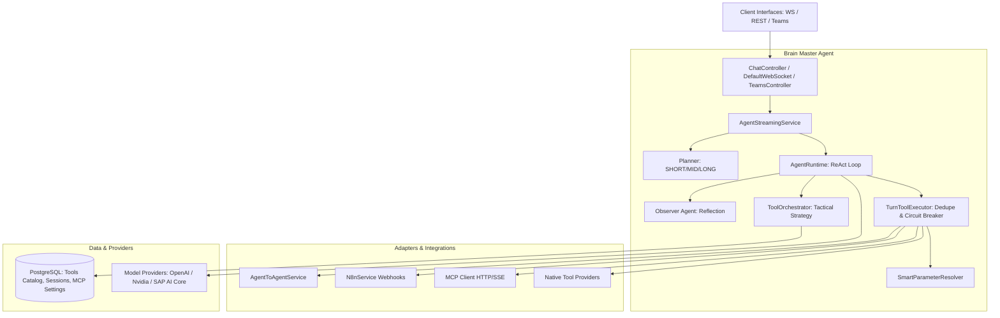

# Technical Documentation: Brain — Master Agent / Agent Harness

This document provides an exhaustive technical overview of the **Brain / Master Agent (Agent Harness)** architecture. It is compiled based *only* on the actual implementation found in the codebase.

---

## 1. Brain Architecture

### Major Modules & Components
The Brain's codebase is structured into the following package modules:
*   **`com.example.agentic_setup.brain.planning`**:
    *   [`Planner.java`](file:///D:/Yash_Code/Agent_Harness/src/main/java/com/example/agentic_setup/brain/planning/Planner.java): Analyzes query complexity and constructs step-budget plans.
    *   [`Observer.java`](file:///D:/Yash_Code/Agent_Harness/src/main/java/com/example/agentic_setup/brain/planning/Observer.java): Reflects on intermediate tool observations to guide next steps.
    *   `PlanningMode.java`: Enum containing complexity modes (`SHORT`, `MID`, `LONG`).
*   **`com.example.agentic_setup.brain.registry`**:
    *   [`McpServerRegistryLoader.java`](file:///D:/Yash_Code/Agent_Harness/src/main/java/com/example/agentic_setup/brain/registry/McpServerRegistryLoader.java): Discovers and loads MCP server configurations.
    *   [`McpServerConnectionResolver.java`](file:///D:/Yash_Code/Agent_Harness/src/main/java/com/example/agentic_setup/brain/registry/McpServerConnectionResolver.java): Resolves transport details, auth tokens, headers, and query parameters.
    *   [`ToolRegistrySyncService.java`](file:///D:/Yash_Code/Agent_Harness/src/main/java/com/example/agentic_setup/brain/registry/ToolRegistrySyncService.java): Syncs tools from active MCP servers to the database tool catalog.
    *   [`ToolEmbeddingService.java`](file:///D:/Yash_Code/Agent_Harness/src/main/java/com/example/agentic_setup/brain/registry/ToolEmbeddingService.java): Generates embeddings for tools for vector search.
*   **`com.example.agentic_setup.brain.runtime`**:
    *   [`AgentRuntime.java`](file:///D:/Yash_Code/Agent_Harness/src/main/java/com/example/agentic_setup/brain/runtime/AgentRuntime.java): Coordinates the explicit ReAct loop.
    *   [`ReActContext.java`](file:///D:/Yash_Code/Agent_Harness/src/main/java/com/example/agentic_setup/brain/runtime/ReActContext.java): Maintains the step-by-step state (thoughts, actions, structured observations).
    *   [`TranscriptLedger.java`](file:///D:/Yash_Code/Agent_Harness/src/main/java/com/example/agentic_setup/brain/runtime/TranscriptLedger.java): Maintains a low-level transcript of OpenAI-specific message items to carry out chat completions.
*   **`com.example.agentic_setup.brain.tools`**:
    *   [`TurnToolExecutor.java`](file:///D:/Yash_Code/Agent_Harness/src/main/java/com/example/agentic_setup/brain/tools/TurnToolExecutor.java): Handles tool call logic, parameter correction, deduplication, and circuit breaking.
    *   [`ToolOrchestrator.java`](file:///D:/Yash_Code/Agent_Harness/src/main/java/com/example/agentic_setup/brain/tools/ToolOrchestrator.java): Recommends relevant tools based on query intent.
    *   [`SmartParameterResolver.java`](file:///D:/Yash_Code/Agent_Harness/src/main/java/com/example/agentic_setup/brain/tools/SmartParameterResolver.java): Resolves missing parameters from history or via LLM-based object construction.
    *   [`AdaptiveToolMemory.java`](file:///D:/Yash_Code/Agent_Harness/src/main/java/com/example/agentic_setup/brain/tools/AdaptiveToolMemory.java): Tracks tool success/failure history to learn parameter adjustment strategies.

### Execution Lifecycle of a Request
```
[User Input]
     │
     ▼
[Endpoint Layer (REST/WS/Teams)] ──> [AgentStreamingService]
                                             │
                                             ▼
                                     [Planner.plan()]
                                (Classify Mode & Budget)
                                             │
                                             ▼
                                   [AgentRuntime.run()]
                                  (Start ReAct Loop)
                                             │
                        ┌────────────────────┴────────────────────┐
                        ▼                                         ▼
           [buildTurnSystemPrompt]                       [selectTools]
           (Inject context + guidance)              (Strategy recommendation)
                        │                                         │
                        └────────────────────┬────────────────────┘
                                             │
                                             ▼
                                    [LLMProvider.chat]
                                (Generate Thought/Action)
                                             │
                                             ▼
                                  [TurnToolExecutor.execute]
                              (Deduplication + Auto-correct)
                                             │
                        ┌────────────────────┴────────────────────┐
                        ▼                                         ▼
            [SmartParameterResolver]                     [Dispatcher.dispatch]
             (Fill missing arguments)                    (MCP / A2A / n8n / Native)
                        │                                         │
                        └────────────────────┬────────────────────┘
                                             │
                                             ▼
                                     [Observer.observe]
                               (Reflect + update guidance)
                                             │
                        ┌────────────────────┴────────────────────┐
                        ▼                                         ▼
              (Goal Met / Out of Budget)                 (Continue ReAct Loop)
              [buildSynthesisInput]                               │
                        │                                         │
                        ▼                                         │
                 [LLM stream response] <──────────────────────────┘
```

1.  **API Entrypoint**: A request arrives via `/api/chat` (REST), `/ws-memory` (WebSocket), or `/api/messages` (Teams).
2.  **Streaming Service**: [`AgentStreamingService`](file:///D:/Yash_Code/Agent_Harness/src/main/java/com/example/agentic_setup/service/AgentStreamingService.java) routes the request.
3.  **Planning Phase**: The [`Planner`](file:///D:/Yash_Code/Agent_Harness/src/main/java/com/example/agentic_setup/brain/planning/Planner.java) classifies the intent and determines the mode (`SHORT`, `MID`, or `LONG`) and budget.
4.  **ReAct Loop Execution**: [`AgentRuntime`](file:///D:/Yash_Code/Agent_Harness/src/main/java/com/example/agentic_setup/brain/runtime/AgentRuntime.java) starts:
    *   Constructs system prompts & queries the catalog.
    *   Calls the LLM provider to decide on the next Thought and Action.
    *   Calls [`TurnToolExecutor`](file:///D:/Yash_Code/Agent_Harness/src/main/java/com/example/agentic_setup/brain/tools/TurnToolExecutor.java) to execute the actions sequentially.
    *   Runs [`SmartParameterResolver`](file:///D:/Yash_Code/Agent_Harness/src/main/java/com/example/agentic_setup/brain/tools/SmartParameterResolver.java) to parse schemas and inject missing parameters.
    *   Calls the active connection transport (MCP, A2A REST, n8n webhook, or local Native tool).
    *   Reflects on the output via [`Observer.observe()`](file:///D:/Yash_Code/Agent_Harness/src/main/java/com/example/agentic_setup/brain/planning/Observer.java) to check for completion and get guidance.
5.  **Synthesis**: Once completed, the final synthesis input gathers the history and generates the end user response.

### Master Agent Implementation
The Master Agent is implemented in the [`AgentRuntime.java`](file:///D:/Yash_Code/Agent_Harness/src/main/java/com/example/agentic_setup/brain/runtime/AgentRuntime.java) class. It acts as the central coordinator that orchestrates the execution lifecycle, invoking the planner, the tool orchestrator, and the tool executor.

### ReAct Loop Details
Yes, a formal ReAct loop is implemented in `AgentRuntime.executeReAct(question, plan, ...)` (lines 398–606). It loops from `step = 0` up to `budget` utilizing the standard Thought → Action → Observation cycle.

### State & Context Maintenance
*   **`ReActContext`**: Maintains the list of executed steps (`ReActCycle`) containing the step number, thought text, tool name, parsed arguments, and structured observations.
*   **`TranscriptLedger`**: Tracks raw LLM-specific items to feed back during continuations.
*   **`ThreadLocalSettings`**: Caches user-specific MCP server enablement settings to avoid N+1 database queries during loop execution.

### Representation of Intermediate Steps
Intermediate steps are represented by `ReActContext.ReActCycle` objects containing the thought text, action schema (tool name and parameters), and the observation output. They are streamed back as `ReasoningEvent` instances to update the UI in real-time.

---

## 2. Agent Orchestration

### Sub-Agent Spawning
Yes, the Master Agent can spawn sub-agents. This is implemented via the `"delegate_task"` tool in [`AgentRuntime`](file:///D:/Yash_Code/Agent_Harness/src/main/java/com/example/agentic_setup/brain/runtime/AgentRuntime.java).

### Representation & Configuration
*   **Representation**: Sub-agents are created by instantiating a fresh `AgentRuntime` in `executeForkedSkill`.
*   **Configuration**: The sub-agent inherits the parent's tools list and LLM Provider configuration but operates with an isolated, tight step budget, its own system prompt, and a fresh `ReActContext`.
*   **Memory Syncing**: The parent's `AdaptiveToolMemory` is synchronized to the child before invocation, and the child's learned patterns are merged back into the parent upon completion.

### Delegation & Style
*   **Decision**: The [`ToolOrchestrator`](file:///D:/Yash_Code/Agent_Harness/src/main/java/com/example/agentic_setup/brain/tools/ToolOrchestrator.java) suggests delegation (`should_delegate: true`) if the task is complex. The LLM then generates a tool call to `delegate_task`.
*   **Delegation Style**: **Sequential**. Tool calls (including sub-agent task delegations) are run sequentially in the turn execution loop.
*   **Nesting**: Yes. Because sub-agents run a full `AgentRuntime`, they can theoretically call `delegate_task` recursively.

---

## 3. Tool Routing

### Registration & Discovery
*   **Registration**: Dynamic discovery from the database `tools` table (syncing tools advertised by active `mcp_servers`). If the DB is down, it falls back to parsing JSON files in `MCP_Configs/`.
*   **Tool Filtering & Selection**: [`ToolOrchestrator`](file:///D:/Yash_Code/Agent_Harness/src/main/java/com/example/agentic_setup/brain/tools/ToolOrchestrator.java) suggests a tactical subset of 3-7 tools from the capabilities catalog based on LLM intent classification, memory failures, and history. If this fails, it falls back to a semantic pgvector search (`ToolVectorSearchService`).

### Tool Classifications & Permissions
*   **Local Tools**: Classes inheriting [`NativeToolProvider`](file:///D:/Yash_Code/Agent_Harness/src/main/java/com/example/agentic_setup/brain/tools/NativeToolProvider.java) (e.g., `CalculatorToolProvider`, `InternetSearchToolProvider`).
*   **MCP Tools**: Handled by [`MCPClient`](file:///D:/Yash_Code/Agent_Harness/src/main/java/com/example/agentic_setup/protocol/mcp/MCPClient.java) (SSE or HTTP transports).
*   **A2A Tools**: Routed to [`AgentToAgentService`](file:///D:/Yash_Code/Agent_Harness/src/main/java/com/example/agentic_setup/protocol/a2a/AgentToAgentService.java) (e.g., `reflect_agent_interact`, `reviewready_agent_interact`).
*   **Workflow Tools**: n8n workflows triggered via webhook calls in [`N8nService`](file:///D:/Yash_Code/Agent_Harness/src/main/java/com/example/agentic_setup/protocol/n8n/N8nService.java).
*   **Permissions & Access Control**: Multi-tenant authorization checks both:
    1.  *Visibility*: Private MCP servers must own the UUID of the request `owner_id`.
    2.  *User Toggle*: The `user_mcp_settings` table allows users to enable/disable specific servers.
*   **Failure Handling**: If an MCP tool returns a validation error, the runner attempts 3 retries after re-resolving parameters. If a session timeout occurs, it triggers `rediscover()` to refresh the connection. Failures are stored in `AdaptiveToolMemory` so the system avoids bad parameters in future turns.

---

## 4. Model Provider Architecture

The codebase integrates three distinct model providers:
1.  **OpenAI** (`DIRECT`):
    *   **Protocol**: Direct HTTP calls to `/v1/responses` (OpenAI Responses API).
    *   **Abstraction**: Decoupled using the `developer` role instead of the standard `system` role, and parses JSON output array items.
2.  **Nvidia** (`NVIDIA`):
    *   **Protocol**: Direct HTTP calls to `/v1/chat/completions` (Standard Chat Completions).
    *   **Abstraction**: Standard JSON payloads containing `tool_calls` and `messages` (roles: `system`, `user`, `assistant`, `tool`).
3.  **SAP AI Core** (`SAP_AI_CORE`):
    *   **Protocol**: HTTP POST endpoint requests routing through the SAP proxy gateway, calling deployment URLs with headers configured for `AI-Resource-Group`. Uses client credentials OAuth against `AICORE_AUTH_URL` for token retrieval.
    *   **Providers Supported**: Claude (`SAP_AI_ANTHROPIC`), Gemini (`SAP_AI_GEMINI`), and Mixtral (`SAP_AI_MIXTRAL`).
    *   *Note*: The SAP AI Core provider integrations do not support tool calling in code; they only return standard text chat completions.

### Provider Abstraction in Simple Terms
The model provider abstraction is defined by the `LLMProvider` interface which acts as a 'wrapper' or 'adapter'. The master agent only calls this wrapper (using methods like `chat` or `complete`), and the wrapper translates these calls into the specific JSON format and HTTP headers required by the vendor's API (e.g., OpenAI's Responses API format vs. Nvidia's standard Chat Completions format vs. SAP AI Core's OAuth token fetch and gateway inference endpoint). This allows the master agent to remain vendor-agnostic and makes swapping models as simple as changing model keys in configs.

---

## 5. Communication Protocols

| Protocol | Implemented? | Location | Description |
| :--- | :--- | :--- | :--- |
| **MCP** | Yes | [`MCPClient.java`](file:///D:/Yash_Code/Agent_Harness/src/main/java/com/example/agentic_setup/protocol/mcp/MCPClient.java) | Connects to external servers using HTTP/SSE or JSON-RPC 2.0. |
| **A2A** | Yes | [`AgentToAgentService.java`](file:///D:/Yash_Code/Agent_Harness/src/main/java/com/example/agentic_setup/protocol/a2a/AgentToAgentService.java) | Direct HTTP REST calls to trigger specialized external agents. |
| **ACP** | No | *N/A* | Discussed in security research notes but not implemented in code. |
| **JSON-RPC 2.0** | Yes | [`JsonRpcController.java`](file:///D:/Yash_Code/Agent_Harness/src/main/java/com/example/agentic_setup/controller/JsonRpcController.java) | Exposes internal tools and LLM completions over `/api/rpc`. |
| **WebSocket** | Yes | [`BaseWebSocketEndpoint.java`](file:///D:/Yash_Code/Agent_Harness/src/main/java/com/example/agentic_setup/controller/BaseWebSocketEndpoint.java) | Multi-threaded endpoints at `/ws` and `/ws-memory`. |
| **SSE / Streaming** | Yes | [`AgentStreamingService.java`](file:///D:/Yash_Code/Agent_Harness/src/main/java/com/example/agentic_setup/service/AgentStreamingService.java) | Streams text deltas from LLMs (OkHttp EventSources) and routes them back via Spring `SseEmitter`. |
| **REST** | Yes | Controllers | Standard HTTP web API controllers (`ChatController`, `CapabilityController`, `N8nController`, `McpServerController`). |

---

## 6. Endpoints

*   **`POST /api/chat`**
    *   *Purpose*: Non-streaming or SSE streaming chat response.
    *   *Input*: `ChatRequest` (JSON containing prompt, vendor, model, stream flag, show_reasoning, userId).
    *   *Output*: Text token stream (SSE) or `ApiResponse` JSON.
*   **`POST /api/stop/{requestId}`**
    *   *Purpose*: Stops a running agent request.
    *   *Input*: URL Path Request ID.
    *   *Output*: Confirmation JSON.
*   **`POST /api/rpc`**
    *   *Purpose*: Exposes gateway services (listing tools, calling tools, completing prompts).
    *   *Input/Output*: Standard JSON-RPC 2.0 request/response.
*   **`POST /api/messages`**
    *   *Purpose*: Receive incoming Teams Bot Framework events.
    *   *Input/Output*: Bot activity JSON. Always returns `200 OK` instantly to prevent timeout errors.
*   **`POST /api/teams/proactive`** & **`POST /api/teams/nudge`**
    *   *Purpose*: Send proactive text messages or nudges to Teams users.
*   **`GET /api/auth/callback`**
    *   *Purpose*: OAuth endpoint for Microsoft Graph profile token exchange.
*   **`GET /api/capabilities`** & **`GET /api/tools`**
    *   *Purpose*: Expose catalog snapshots.
*   **`POST /api/n8n/workflows/{id}/run`**
    *   *Purpose*: Trigger registered n8n webhooks.
*   **`POST /api/automation`**
    *   *Purpose*: Runs mechanical executions (predefined tool sequences).

---

## 7. Memory

*   **Session Memory**: Persisted in the database `chat_memory` table. Saves the conversation history (pruned to retain only the **last 3 messages** to manage context windows).
*   **Short-Term ReAct Context**: The active reasoning cycle history (Thought/Action/Observation) is tracked in-memory using `ReActContext` and `TranscriptLedger`.
*   **Adaptive Memory**: Tracks tool invocation failures and successes (`AdaptiveToolMemory`) to adjust parameter structures dynamically.
*   **Semantic Tool Discovery**: Uses PostgreSQL `pgvector` operators (`<=>` cosine distance) to perform semantic vector searches for relevant tools based on query embeddings.
*   *Note*: The codebase does not implement long-term facts memory databases, graph memory, or document-based RAG.

---

## 8. Observer & Monitoring

*   **Observer Agent**: Implemented in [`Observer.java`](file:///D:/Yash_Code/Agent_Harness/src/main/java/com/example/agentic_setup/brain/planning/Observer.java). In `MID` and `LONG` planning modes, the Observer evaluates observations and outputs guidance. If it detects a delegated task has been completed or is active, it advises the agent to wait or progress.
*   **Search Circuit Breakers**: Built into the turn executor. If a search tool is called 4+ times, or returns empty results 3 times consecutively, the search is blocked to avoid infinite looping.
*   **Self-Correction / Identity Autocorrect**: The host automatically Swaps/Injects valid user metadata (`email`, `sf_user_id`, `context`) into tool parameters at runtime by resolving the request's database user profile.

---

## 9. Prompt Architecture

*   **Turn System Prompts**: Built dynamically in `buildTurnSystemPrompt`. Contains the current time, user ID, previous step outcomes, planner intent, and guidance from the Observer.
*   **Prompt-as-a-Tool**: Deferred prompts (`get_prompt__`) list templates as tools. The LLM can choose to invoke these prompts, which are returned as system prompt templates for final synthesis.
*   **Dynamic Context Injection**: Avoids huge system prompts by only mounting:
    *   The 3-7 tools recommended by `ToolOrchestrator`'s strategy analysis.
    *   The active Observer guidance.
    *   Recent failure patterns from memory.
    *   This dynamic assembly ensures the context window is not saturated by irrelevant tools.

---

## 10. Security

*   **Authentication (Implemented)**: Bot Framework JWT tokens are verified in [`BotAuthFilter.java`](file:///D:/Yash_Code/Agent_Harness/src/main/java/com/example/agentic_setup/connector/teams/security/BotAuthFilter.java) using Nimbus JOSE against Microsoft JWKS endpoints.
*   **Authorization (Implemented)**: Verified in `McpServerManagementService`. Modifying or deleting private servers requires matching user ownership.
*   **Tool/Agent Permissions (Implemented)**: Restricts private tools from matching other user UUIDs using DB-level checks.
*   **Identity Keyring / JWT Auth for standard REST APIs (Planned)**: Not implemented; standard REST and WebSocket endpoints are open (`permitAll()` in `SecurityConfig`).
*   **PII Filters & Output Guardrails (Planned)**: Not implemented (only a hardcoded off-topic checker is present in `PromptBuilderService`).

---

## 11. Integrations

*   **MS Teams / Bot Framework**: Implemented via Spring integration endpoints.
*   **n8n**: Implemented via `N8nService` webhooks.
*   **MCP Servers**: Implemented via `MCPClient`.
*   **A2A Agents**: Implemented via REST interfaces to reflecting agents in `AgentToAgentService`.
*   **SuccessFactors**: Partially implemented (the runtime resolves credentials from the database, but delegates actual query execution to A2A endpoints).
*   **Blend / Blend Courses**: Partially implemented (mock tool registrations exist in the DB, but no actual connector is implemented in the Java harness).
*   **Copilot Studio**: Not implemented.
*   **TalentBot**: Planned architectural placeholder (env configurations only, no integration code).
*   **RAG**: Not implemented.

---

## 12. Error Handling & Reliability

*   **Tool Call Failures**: Sequential 3-attempt retries for validation errors, re-evaluating missing schemas or applying fallback defaults.
*   **Session Timeouts**: Session refresh (`rediscover()`) is triggered on MCP server connection failures.
*   **LLM / Provider Timeouts**: Implements a 90-second read timeout on the Nvidia/OpenAI clients and a 5-minute timeout on the A2A client.
*   **Mechanical Fallbacks**: The `AutomationExecutor` runs deterministic sequences if LLM planning fails or is bypassed.

---

## 13. Observability

*   **Console Logging**: Step-by-step progress, strategy metrics, and hands-on debugging outputs.
*   **Request tracking**: A request ID is passed through WebSocket frames.
*   *Note*: The codebase does not integrate OpenTelemetry, Zipkin, Prometheus, or structured tracing libraries.

---

## 14. Plugin / Composable Architecture

The codebase supports composability:
*   **New Provider**: Implement `LLMProvider` and add mapping inside `LLMProviderFactory`.
*   **New Tool**:
    *   *Native*: Implement `NativeToolProvider` (auto-scanned by Spring).
    *   *MCP*: Upsert connection details into database `mcp_servers`.

---

## 15. TalentBot Integration

**Status**: **Planned / Architectural Vision**.
There is no actual integration implementation, Java class, or tool connector for TalentBot in the codebase. It is only mentioned as a planned environment variable (`TALENTBOT_URL`) in the `doc.md` documentation.

---

## 16. Scale & Performance

*   **Cached Settings**: MCP user enablement is bulk-loaded into `ThreadLocal` variables during request initiation, eliminating N+1 DB queries in loop cycles.
*   **Asynchronous Processing**: Teams Bot activity immediately returns `200 OK` to Teams and executes the agent work asynchronously in a separate thread.
*   **Context Pruning**: Restricts database conversation histories to the last 3 turns to prevent token bloat.

---

## 17. Architecture Diagram



---

## 18. Reality Check

### A. Actually Implemented
*   **Explicit ReAct Loop**: Planner complexity analysis, step budgets, turn system prompts, and final synthesis.
*   **Observer Agent**: Progress reflection, fact extraction, and next-step bias directives.
*   **Dynamic MCP Client**: Handshake, SSE/HTTP transports, and capability listing.
*   **A2A Integration**: Triggering external agents (Reflect, ReviewReady) over REST.
*   **Smart Parameter Resolution**: Filling missing parameters from history or LLM object construction.
*   **Circuit Breakers**: Disallowing excessive searches or loop traps.
*   **Deduplication**: Blocking repeated calls to non-execution tools.
*   **Teams Bot / Microsoft Bot Framework**: Token authentication (`BotAuthFilter`), proactive message dispatch, and MS Graph OAuth callback.
*   **JSON-RPC 2.0 Gateway**: Controller and services exposing capabilities over `/api/rpc`.
*   **PostgreSQL Catalog**: Storing tool records, session memory, and user configurations.
*   **ThreadLocal Caching**: Caching settings to prevent database connection exhaustion.
*   **Deterministic Workflows**: `AutomationExecutor` running step-by-step sequences.

### B. Partially Implemented / Experimental
*   **SAP AI Core Integration**: Implements Claude, Gemini, and Mixtral chat completions, but does *not* support tool calling.
*   **JWT Client authentication**: Configured for Teams bot authorization, but not used across standard agent REST APIs.
*   **cpm_agent_interact**: Registered in database bootstrap, but local implementation is deprecated.

### C. Planned / Architectural Vision
*   **ACP (Agent Communication Protocol)**: Described as a WebSocket protocol standard but not implemented.
*   **TalentBot**: Listed in docs and environment settings but completely absent from source code.
*   **Long-Term RAG / Semantic Facts Database**: Memory is strictly session-based and limited to the last 3 turns.
*   **External SAP / SuccessFactors API Client**: Credential metadata keyrings are resolved, but the actual SuccessFactors HTTP clients are not implemented.

---

## "Brain in 10 Bullets"

1.  **Multi-Tenant Settings Caching**: Eliminates N+1 database bottlenecks by loading all user MCP settings into a `ThreadLocal` cache during turn initiation.
2.  **Tactical Tool Orchestration**: Prevents prompt bloat by strategically selecting only 3-7 relevant tools instead of loading the entire database catalog into the LLM system prompt.
3.  **Autonomous Parameter Recovery**: Features a resolver that extracts missing parameters from history or calls an LLM to build complex nested JSON objects.
4.  **Observer-Guided Reflection**: Employs an Observer agent that analyzes outcomes to output dynamic guidance directives, steer search execution, and identify completion.
5.  **Multi-Vendor Abstraction Layer**: Decouples logic from LLM implementations using a unified `LLMProvider` interface.
6.  **Search-Specific Circuit Breakers**: Halts search tools while leaving side-effectful execution triggers active if search loops run empty.
7.  **Microsoft Teams Non-Blocking Execution**: Resolves Teams timeouts by responding with `200 OK` instantly and running the agent thread asynchronously before pushing replies proactively.
8.  **Strict Deduplication Policy**: Avoids wasting API tokens by blocking duplicate calls while exempting workflows and delegated sub-agent tasks.
9.  **Standardized JSON-RPC 2.0 Gateway**: Exposes internal capabilities, tool directories, and LLM completions over standard JSON-RPC.
10. **Dual MCP Transport Support**: Supports both standard HTTP/SSE streams and custom HTTP transports.
