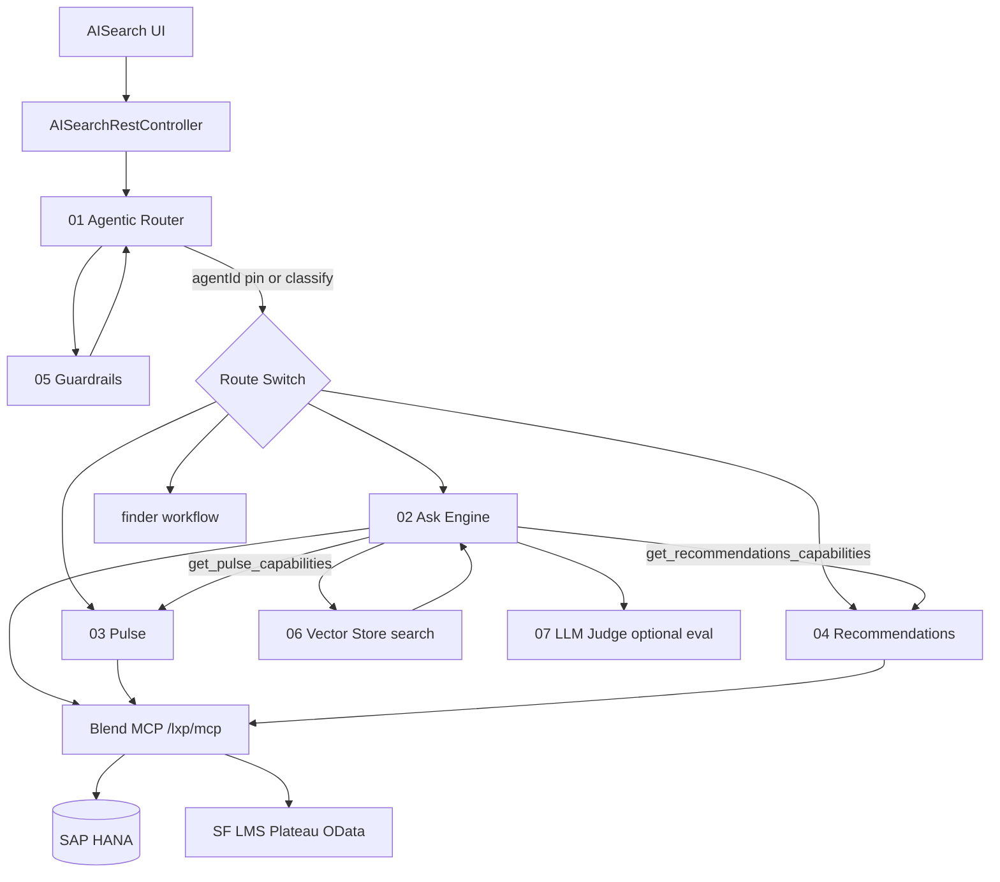

# BlendLXP Agentic Platform — Current-State Documentation

**Generated:** 2026-08-27  
**Scope:** Evidence from codebase only (`/home/yash/Desktop/BlendLXP`). No inferred production metrics unless cited from code, config, tests, or docs.  
**Primary repos:** `LearningContentPack` (Java + n8n workflows), `TTCommon` (shared SAP/LMS/HANA), `UI` (schemas, prompt-lab docs, workflow mirrors), `Agent_Harness` (separate demo).

---

## Document conventions

| Label | Meaning |
|-------|---------|
| **Implemented** | Runnable code/workflow exists in repo |
| **Partial** | Some paths live; gaps documented in code/docs |
| **Planned** | Described in docs/TODOs; not fully wired |
| **Not found** | No matching implementation in searched paths |

---

## 1. Project / Repository Overview

### High-level architecture (implemented split)

```
Blend UI (AISearch widget)
    │  POST /api/ai/search/query
    ▼
AISearchRestController  →  n8n Agentic Router (webhook)
    │                         │ guardrails (05)
    │                         │ classify → route
    │                         ▼
    │                    Agent workflows (02–04)
    │                         │ ReAct + MCP tools
    │                         ▼
    └──────────────────  Spring AI MCP server (/lxp/mcp)
                              │ @McpTool + query_entity
                              ▼
                         HANA + SF LMS/BizX APIs
```

**Design docs** still describe an older “Blend REST tool dispatcher” model (`POST /api/agentic/tools/{toolName}`) as **planned**; **live exposure is Spring AI MCP** (`spring.ai.mcp.server.protocol=STREAMABLE`). See `LearningContentPack/docs/agentic/EXECUTION-PLAN.md`, `tool-server-spec.md`.

### Major modules / packages (with paths)

| Component | Role | Path(s) | Status |
|-----------|------|---------|--------|
| **AI Search proxy** | UI → n8n router; quota, SSE telemetry | `LearningContentPack/src/main/java/com/talenteam/aisearch/AISearchRestController.java`, `AiSearchTurnHub.java`, `AISearchStreamController.java` | **Implemented** |
| **MCP tool server** | Data access for agents | `LearningContentPack/src/main/java/com/talenteam/mcp/tool/*.java`, `com.talenteam.mcp.data.*` | **Implemented** |
| **MCP server config** | Server name, Spring AI MCP | `TTCommon/TTCommon-Core/.../McpServerConfig.java`, `application.properties` (`spring.ai.mcp.server.protocol=STREAMABLE`) | **Implemented** |
| **Agentic Router** | Intent + dispatch | `LearningContentPack/n8n_workflows/01-BlendLXP - Agentic Router.json` | **Implemented** |
| **Ask Engine** | Planner + executor + widgets | `LearningContentPack/n8n_workflows/02-BlendLXP - Ask Engine.json` | **Implemented** |
| **Pulse Agent** | Nudge cards | `LearningContentPack/n8n_workflows/03-BlendLXP - Pulse(Nudge) Agent.json` | **Implemented** |
| **Recommendations Agent** | Catalog/discovery | `LearningContentPack/n8n_workflows/04-BlendLXP - Recommendations Agent.json` | **Implemented** |
| **Guardrails** | Rule packs (PII, scope, injection) | `LearningContentPack/n8n_workflows/05-BlendLXP - Guardrails.json` | **Implemented** |
| **MCP Tools Vector Store** | In-memory tool embeddings | `LearningContentPack/n8n_workflows/06-BlendLXP - MCP Tools Vector Store.json` | **Implemented** |
| **LLM Judge** | LLM-as-judge eval | `LearningContentPack/n8n_workflows/07-BlendLXP - LLM Judge.json` | **Implemented** |
| **Response envelope schema** | Universal JSON shape | `UI/schemas/agent_response.v1.json` | **Implemented** (schema); enforced in n8n Finalize nodes |
| **Semantic analytics tool** | `query_entity` | `LearningContentPack/.../QueryEntityToolConfig.java`, `QueryEntityToolCallback.java`, `com.talenteam.mcp.query.*` | **Implemented** |
| **Java orchestrator (legacy)** | IntentClassifier, AgentRouter, CardComposer | Removed per `docs/agentic/architecture-n8n.md` §8 | **Not in codebase** (reverted) |
| **REST tool dispatcher** | `POST /api/agentic/tools/{name}` | `docs/agentic/tool-server-spec.md` | **Planned** (superseded by MCP in practice) |
| **Agent Harness demo** | Alternate agent runtime | `Agent_Harness/agent-harness-demo/` | **Separate POC** |
| **TTCommon LMS/HANA** | SF Plateau, BizX OData | `TTCommon/TTCommon-LMS/.../LMSClientService.java`, `TTCommon-Core/.../SuccessFactorsClientService.java` | **Implemented** (platform-wide) |

### Placeholders / future (from docs)

- `POST /api/agentic/query` Java proxy (Phase 4 in `EXECUTION-PLAN.md`) — **Partial** (`AISearchRestController` covers AI Search only)
- JWT passthrough auth for n8n→Blend — **Deferred** (`architecture-n8n.md` §6)
- Full manager/admin authz on team tools — **Backlog** (`tools-inventory.md`, Phase 5)
- `UserAndProfileMcpTools` class — **Data layer ready; class missing** (`tools-inventory.md`)

---

## 2. Agent Inventory

### Count

| Category | Count | Evidence |
|----------|------:|----------|
| **Primary routed agents** | **4** | `KNOWN_AGENTS = ['ask','pulse','recommendations','finder']` in `01-BlendLXP - Agentic Router.json` |
| **Supporting n8n workflows** | **3** | Guardrails (05), Vector Store (06), LLM Judge (07) |
| **Legacy widget agents (OLD/)** | **8+** | `UI/n8n_workflows/OLD/` — superseded by Ask Engine `build_*` tools |

### Agent table

| agentId | Workflow file | Purpose | Router? | Tools? | A2A? |
|---------|---------------|---------|---------|--------|------|
| `ask` | `02-BlendLXP - Ask Engine.json` | Learning Q&A, widget grid, MCP fan-out | **Yes** (default fallback) | **Yes** (Blend MCP Connector + `build_*`) | **Partial** — fetches Pulse/Recommendations **Agent Cards** |
| `pulse` | `03-BlendLXP - Pulse(Nudge) Agent.json` | Proactive nudge cards | **Yes** | **Yes** | **Partial** — publishes `a2a-capability/v1` Agent Card via `mode=capabilities` |
| `recommendations` | `04-BlendLXP - Recommendations Agent.json` | Catalog/discovery specialist | **Yes** | **Yes** | **Partial** — Agent Card in workflow JS |
| `finder` | Routed in router; **no dedicated `04`-style numbered workflow in LCP folder** | Residual vague navigation | **Yes** | Unknown dedicated wf in LCP | No |
| `router` | `01` (steer path) | Out-of-scope steer response | Internal | No | No |
| `guardrails` | `05` | Input/output rule packs | Called by 01/02 | No | No |
| `llm-judge` | `07` | Offline/online eval scoring | Webhook only | No | No |

### Agent hierarchy (Mermaid — from implementation)



### Internal invocation (not full A2A protocol)

- Ask Engine **does not** run full Pulse/Recommendations ReAct loops for inherit mode; it calls **capability-only** sub-workflows and reads Agent Cards (`UI/Documentations/ask5-pulse-a2a-capabilities.md`).
- Pulse `mode=capabilities` returns card metadata only (`03` workflow early exit).

### Java `@Agent` classes

**Not found** — removed per `architecture-n8n.md` §8.

---

## 3. Tool / MCP Inventory

### Counts (code, 2026-08-27)

| Metric | Count | Source |
|--------|------:|--------|
| `@McpTool` annotations in `com.talenteam.mcp.tool` | **64** | `rg '@McpTool(name' LearningContentPack/src/main/java/com/talenteam/mcp/tool` |
| `@ParkedMcpTool` (source kept, not registered) | **16** | Same directory |
| `ParkedMcpToolNames.NAMES` (canonical parked set) | **16** | `ParkedMcpToolNames.java` |
| Programmatic MCP tool | **1** | `query_entity` via `QueryEntityToolConfig.java` |
| **Registered live (typical)** | **65** | 64 annotated + `query_entity` (minus any runtime `@Conditional` gating) |
| Doc inventory (tracker) | **61 live / 22 parked** | `docs/agentic/tools-inventory.md` — **drifts from code** (doc last updated 2026-07-28) |

### MCP server

| Item | Value | Evidence |
|------|-------|----------|
| Endpoint | `{app}/lxp/mcp` | Used in diagnostics / `AISearchRestController` forwards `mcpUrl` |
| Protocol | STREAMABLE | `application.properties`: `spring.ai.mcp.server.protocol=STREAMABLE` |
| Server name | `mcp-service-{companyID}` | `McpServerConfig.java` |
| Registration | Spring AI `@McpTool` scan + `ToolCallbackProvider` | `McpToolRegistrationTest.java`, `QueryEntityToolConfig.java` |
| Node role gate | **`MCP` in `-DallowedNodeRoles=...`** | `IsMcpNodeCondition.java`; holders split between `IsMcpNodeCondition` and `IsJobNodeCondition` |

### Tool holder classes

| Holder | Live `@McpTool` | Parked | Path |
|--------|----------------:|-------:|------|
| ActivityMcpTools | 7 | 0 | `.../ActivityMcpTools.java` |
| ProfileMcpTools | 8 | 0 | `.../ProfileMcpTools.java` |
| SkillsMcpTools | 9 | 1 | `.../SkillsMcpTools.java` |
| CatalogMcpTools | 7 | 2 | `.../CatalogMcpTools.java` |
| QuestsMcpTools | 7 | 0 | `.../QuestsMcpTools.java` |
| LearningMcpTools | 4 | 5 | `.../LearningMcpTools.java` |
| RecommendationsMcpTools | 3 | 0 | `.../RecommendationsMcpTools.java` |
| PathwayMcpTools | 4 | 2 | `.../PathwayMcpTools.java` |
| TracksMcpTools | 4 | 0 | `.../TracksMcpTools.java` |
| OrgCareerMcpTools | 3 | 2 | `.../OrgCareerMcpTools.java` |
| AssessmentMcpTools | 3 | 0 | `.../AssessmentMcpTools.java` |
| MemoryMcpTools | 2 | 0 | `.../MemoryMcpTools.java` |
| TopicMcpTools | 2 | 0 | `.../TopicMcpTools.java` |
| PolicyMcpTools | 1 | 0 | `.../PolicyMcpTools.java` |
| GamificationMcpTools | 0 | 2 | `.../GamificationMcpTools.java` |
| AdminMcpTools | 0 | 2 | `.../AdminMcpTools.java` |
| QueryEntityToolConfig | 1 | 0 | `query_entity` |

### Full live tool list (64 `@McpTool` names)

**Activity:** `get_upcoming_events`, `get_class_offerings`, `get_selected_classes`, `get_announcements`, `get_notifications`, `get_user_activity_pattern`, `get_highlights`

**Catalog:** `search_catalog`, `get_save_for_later`, `get_continue_watching`, `get_no_activity_courses`, `get_content_ratings`, `get_course_likes`, `get_trending_content`

**Learning:** `get_training_history`, `get_learning_plan`, `get_stalled_learning`, `get_curriculum_statistics`

**Recommendations:** `get_recommendations`, `get_peer_recommendations`, `get_recently_accessed`

**Skills:** `get_skills`, `upsert_user_skill`, `find_skill_experts`, `get_user_profile`, `get_badges`, `get_skill_gap`, `get_skill_matrix`, `get_skill_competency_mapping`, `get_top_skills_analytics`

**Profile:** `get_personal_info`, `get_goals`, `get_career_goals`, `get_dev_goals`, `get_learning_preferences`, `get_user_dossier`, `get_profile_image`, `get_logged_in_user_count`

**Pathways:** `list_pathways`, `get_pathways`, `get_playlist_courses`, `get_assigned_playlists`

**Tracks:** `list_tracks`, `get_track_details`, `get_assigned_tracks`, `get_journey_content`

**Quests:** `list_quests`, `get_quest_details`, `get_enrolled_quests`, `get_available_quests`, `get_completed_quests`, `get_quest_assignments`, `get_quest_analytics`

**Org/Career:** `get_leaderboard`, `get_topic_interests`, `get_role_skill_profile`

**Topics:** `get_popular_topics`, `get_searched_words`

**Assessment:** `list_assessments`, `get_assessment_results`, `get_course_training_assessments`

**Memory:** `get_memory`, `save_memory`

**Policy:** `search_policies`

**+ programmatic:** `query_entity` (entities: completion, learner, course, pathway, event, assignment, badge, skill — `SemanticModel.java` / docs)

### Tool discovery & selection (Ask Engine)

| Mechanism | Details | Evidence |
|-----------|---------|----------|
| **Static MCP list** | n8n MCP Client `tools/list` | Ask Engine lexical path |
| **Vector retrieval** | n8n Simple Vector Store, key `blendlxp_mcp_tools`, embed `text-embedding-3-small` | `06-BlendLXP - MCP Tools Vector Store.json` |
| **Lexical fallback** | BM25F + TF-IDF + RRF on live tool list | `02` workflow node “Tool Router (Lexical)” |
| **Pre-rerank cap** | TOP_K = **50** | Ask Engine JS |
| **Final allowlist** | FINAL_K = **20** (after optional rerank) | Ask Engine “Rerank Tools” node |
| **Default rerank** | **OFF** (`enableRerank: false`) | Sticky notes + Rerank node |
| **Schemas** | `@McpTool` description + `@McpToolParam`; JSON Schema via Spring AI | `McpToolRegistrationTest.java` |
| **Agent access** | Not hard-assigned per agent in Java — **n8n prompts + allowlists** filter which tools the LLM sees | Planner + `Allowed MCP tools` in Ask Engine |

### n8n `build_*` tools (NOT MCP — response builders)

| Tool | Type | Role |
|------|------|------|
| `build_results` | n8n Code Tool | Catalog/results widget |
| `build_sources` | n8n Code Tool | Thin citations widget |
| `build_next_actions` | n8n Code Tool | CTA chips |
| `build_related_actions` | n8n Code Tool | Related actions; can embed Pulse-shaped cards |
| `build_skill_profile` | n8n Code Tool | Skill profile widget |
| `get_widget_capabilities` | n8n tool | Widget schema for planner |

Evidence: `02-BlendLXP - Ask Engine.json` node names and widget catalog JS.

---

## 4. Agentic Router

### Implementation location

`LearningContentPack/n8n_workflows/01-BlendLXP - Agentic Router.json`  
Webhook: `agentic-router-prod` (POST). Mirror: `UI/n8n_workflows/01-BlendLXP - Agentic Router.json`.

### Flow (code evidence)

```
User Query (HTTP POST)
    ↓
Router Webhook
    ↓
Build Context (normalize body, debugTrace, memory, toolRouting flags)
    ↓
Context OK? ──no──→ Format Router Error → Respond
    ↓ yes
Prepare Router Guardrails → Run Guardrails (05) → Apply Guardrails Result
    ↓
Learning Scope OK? ──no──→ Learning Scope Steer → Wrap Response → Respond
    ↓ yes
Route Switch
    ├─ agentId provided? → direct to agent workflow
    └─ else → Classify Intent (LLM, Azure OpenAI)
              ↓
         Parse Classification (KNOWN_AGENTS, default 'ask')
              ↓
         Route Switch → Execute Workflow: Ask | Pulse | Recommendations | Finder
              ↓
         Wrap Response (agent_response.v1)
              ↓
         Stream Ask? (SSE if stream=true & agentId=ask)
              ↓
         Respond to Webhook
```

### Inputs (representative)

From `Build Context` / webhook normalization: `userId`, `tenantId`, `message`, `conversationId`, `traceId`, `agentId?`, `debug`, `stream`, `memory`, `priorQuery`, `toolRouting`, `forceBm25`, `mcpUrl`, `turnId`, `toolEventUrl`, etc.

### Outputs

`agent_response.v1` envelope via `Wrap Response` — see §8.

### LLM usage

**Yes** — `Classify Intent` uses Azure OpenAI Chat Model with a one-word classifier prompt (`ask | pulse | recommendations | finder`).

### Rule-based logic

| Rule | Behavior |
|------|----------|
| Pinned `agentId` | Skips classification when provided (`Route Switch`) |
| Parse fallback | Unparseable classifier output → **`ask`** |
| Guardrails | PII sanitize, learning scope, injection_lite, tenant_policy, etc. |
| Out-of-scope steer | Fixed narrative + followups (`Learning Scope Steer`) |
| Error paths | `success:false`, `error.node`, `httpStatus` |

### Multi-intent / multi-agent

- **One agent per request** (single `resolvedAgent`).
- **No multi-agent fan-out** at router level.
- **Ambiguous:** defaults to `ask`.
- **Nothing matches:** defaults to `ask` (not an error).
- **Routing cache:** **Not found** in router workflow.
- **Routing before retrieval:** **Yes** — agent selected before Ask Engine tool routing runs inside `02`.
- **Tool-search space reduction:** **Yes** — inside Ask Engine only (vector/BM25 → top 20), not in router.

---

## 5. Intent Detection

### Implementations

| Layer | Mechanism | Location |
|-------|-----------|----------|
| **Router LLM classifier** | Single-word intent | `01` → `Classify Intent` |
| **Guardrails `ask_intent` pack** | Rule pack | `05-BlendLXP - Guardrails.json` |
| **Ask Query Understanding** | Alias/synonym/typo expansion (pre-retrieval) | `02` → `Query Understanding` |
| **Ask Planner LLM** | Widget + ingredient planning | `02` → `Plan Ingredients` / `Planner LLM` |
| **Java legacy** | IntentClassifier | **Removed** (`architecture-n8n.md`) |

### Hybrid rules + AI (Ask Engine)

1. **Query Understanding** (rules) runs before vector/BM25 routing.
2. **Tool routing** (vector or BM25F+TF-IDF+RRF) selects MCP allowlist.
3. **Planner LLM** chooses widgets and MCP ingredients.
4. **Executor LLM** (AI Agent) runs ReAct with allowlisted MCP + `build_*` tools.

**Override behavior:** Not documented as explicit “rules override AI” — guardrails can rewrite/sanitize `message` before classification (`Apply Guardrails Result`).

### Intent categories (router)

**4:** `ask`, `pulse`, `recommendations`, `finder` — defined in `Parse Classification` node.

**Hierarchical intents:** **Not found** at router level. Ask Planner uses **widget ids** (`results`, `skill_profile`, `upcoming_classes`, …) — flat allowlist in `02` JS (`WIDGET_ALLOW` set).

### Confidence thresholds

Router classifier: **No confidence score** — substring match on LLM output.  
LLM Judge: pass ≥ **0.75**, partial ≥ **0.4** (`07-BlendLXP - LLM Judge.json`).

### Examples / tests

| Test | Location |
|------|----------|
| MCP tool registration | `src/test/java/com/talenteam/mcp/McpToolRegistrationTest.java` |
| AI Search SSE hub | `src/test/java/com/talenteam/aisearch/AiSearchTurnHubTest.java` |
| Intent routing eval samples | `UI/tmp/user_context/runs/*.response.json` (manual runs, not automated CI) |
| LLM Judge webhook | `07-BlendLXP - LLM Judge.json` |

**Automated routing/intent test suite:** **Not found**.

---

## 6. Ask Engine

### Responsibility

Execute **Planner-chosen widgets** for learning discovery/Q&A: MCP data fetch + rule-based widget assembly (`build_*`), narrative via LLM.

Doc: `docs/agentic/agents/ask-engine.md` (design); live behavior in `02` workflow supersedes (Planner + widgets).

### Request path (synchronous critical path)

```
Trigger (from Router Execute Workflow)
    ↓
Build Context
    ↓
Query Understanding
    ↓
Use Vector Search? → [Vector path | BM25 lexical path]
    ↓
Tool allowlist (50 → 20)
    ↓
Plan Ingredients → Planner LLM → Apply Plan
    ↓
Build Prompt
    ↓
AI Agent (ReAct: MCP Connector + build_* Code Tools)
    ↓
Extract Tools used → Build Widgets → Finalize Response
```

### Context entry

- Router forwards `memory`, `priorQuery`, `userId`, `message`.
- **No server-side dossier prefetch** in Ask — sticky note: agents must use live MCP (`02` workflow).

### Parallelism

- n8n ReAct may interleave tools; **no explicit parallel MCP fan-out** in workflow JSON beyond agent behavior.
- Widget build is **sequential** in Extract/Build nodes.

### Streaming

- **Partial:** SSE for tool events + narrative tokens via `AiSearchTurnHub` (`/api/ai/search/events/{turnId}`, `/token-event`).
- Router `stream=true` on Ask can emit end-output SSE (`Prepare SSE (Ask)`).

### Failures / retries

- MCP tool failures surface in agent observations; `McpEmptyReason` in Java tools.
- AgenticEventsQuery LMS fan-out: **2s hard timeout** (`SERVICE_TIMEOUT_MS = 2_000L` in `AgenticEventsQuery.java`).
- n8n read timeout for UI proxy: **360000 ms** default (`ai.search.n8n.read-timeout-ms` in `AISearchRestController.java`).

### Cache / persistence

| Item | Storage |
|------|---------|
| Short-term chat memory | **Browser** → forwarded in request (`memory.items`, max **2 turns**) |
| Long-term preferences | **HANA** via `get_memory` / `save_memory` MCP |
| Tool vector index | **n8n in-memory** (lost on restart) |
| Turn telemetry buffer | **JVM heap** (`AiSearchTurnHub`, max 500 events/turn) |

---

## 7. Capability Architecture

### Canonical abstractions

| Term | What it actually is | Evidence |
|------|---------------------|----------|
| **MCP tool** | Primary capability unit for data | `@McpTool` Java methods |
| **n8n `build_*` tool** | Widget response builder (not data) | `02` Ask Engine Code Tools |
| **Widget** | UI card type (`results`, `sources`, …) | Ask widget catalog in `02` |
| **Agent Card (`a2a-capability/v1`)** | JSON capability pack (skills, tool allowlist, schema) | Pulse/Recommendations workflows; `ask5-pulse-a2a-capabilities.md` |
| **Java “capability”** | Not a single registry class in LCP | Agent Harness has `CapabilityCatalogService` (separate project) |

### Registration / discovery

- **MCP tools:** Spring component scan + `@Conditional` node roles.
- **Ask widgets:** Hardcoded catalog in n8n JS + `get_widget_capabilities`.
- **Agent cards:** Sub-workflow early-return modes.

### Reuse

- MCP tools shared across all agents.
- Pulse card shape reused in Ask via `build_related_actions` (inherit mode).

---

## 8. Universal Response Format

### Schema definition

`UI/schemas/agent_response.v1.json`

### Required top-level fields

`schemaVersion`, `success`, `agentId`, `narrative`, `suggestedFollowups`, `widgets`, `toolsUsed`, `model`, `usage`, `meta`

### Typical Ask payload shape

```json
{
  "schemaVersion": "agent_response.v1",
  "success": true,
  "agentId": "ask",
  "narrative": "...",
  "suggestedFollowups": [],
  "widgets": [
    { "type": "results", "items": [], "title": "..." }
  ],
  "toolsUsed": [{ "name": "search_catalog", "ok": true }],
  "model": { "provider": "azure-openai", "model": "...", "nodes": [] },
  "usage": { "inputTokens": null, "outputTokens": null, "totalTokens": null, "steps": [] },
  "meta": {}
}
```

### Enforcement

- **JSON Schema** in UI repo.
- **n8n `Wrap Response` / `Finalize Response`** JS copies helpers referencing schema.
- **Not** a single Java DTO for all agents — proxy parses `Map<String,Object>`.

### Frontend consumption

- `LearningContentPack/src/main/resources/static/js/AISearch/AISearch.js`
- `AISearch.widgets.js` renders `widgets[]`; narrative in markdown stream.

---

## 9. Shared Context Contract

### Is there a shared context object?

**Partial** — convention over strict class:

| Layer | Shape | Fields (representative) |
|-------|-------|-------------------------|
| Router/Ask n8n JSON | Flat workflow item | `userId`, `tenantId`, `message`, `memory`, `guardrails`, `learningScope`, `selectedTools`, `plan`, `debugTrace[]` |
| Short-term memory | `{ items: [{ role, text, ts? }] }` | Max **2** turns; user clip **1200** chars; assistant **3000** chars — `AISearchRestController.java`, `AISearch.js` |
| MCP tools | Per-tool args + `userId` | Always supplied by n8n connector |
| Java session | `UserSessionBean` | Identity for proxy — not passed agent-to-agent |

**Immutable shared Java “AgentContext”:** **Removed** with legacy orchestrator.

**Cross-agent pass:** Router forwards same JSON blob to sub-workflows; Ask may call Pulse/Recommendations for **Agent Card only**.

---

## 10. Retrieval / Tool Discovery

### Claim verification

| Claim | Status | Evidence |
|-------|--------|----------|
| **RAM index** | **Partial** | n8n Simple Vector Store in-memory (`06` readme: “In-memory only — lost on n8n restart”) |
| **BM25** | **Implemented** | Lexical router JS: `BM25_K1`, `BM25_B` in `02` |
| **BM25F** | **Implemented** | Node comment: “BM25F + TF-IDF + RRF” |
| **TF-IDF** | **Implemented** | Same lexical node |
| **Elias dictionary** | **Not found** | No matches in agentic workflows/Java |
| **LSA** | **Not found** | No matches in agentic code (only unrelated files) |
| **Stemming/tokenization** | **Partial** | `STEM_MAP` + tokenization in lexical JS |
| **Field weighting** | **Yes** | `NAME_WEIGHT = 2`, `INTENT_WEIGHT = 1` |
| **RRF fusion** | **Yes** | `RRF_K = 60` |
| **Second-stage reranker** | **Optional** | Default OFF; `rerankMode: local|http`, `rerankTopN: 20`, `rerankTimeoutMs: 2500` |
| **Embeddings** | **Yes** | `text-embedding-3-small` in vector ingest (`06`) |
| **Vector DB dependency** | **No external DB** | n8n in-process store only |

### Candidate counts (from code constants)

| Stage | Count | Source |
|-------|------:|--------|
| Vector/BM25 pre-rerank | **50** | `TOP_K = 50` in `02` |
| Final allowlist | **20** | `FINAL_K = 20` / `rerankTopN` default |
| Vector search webhook default | **20** | `06` search body `topK` |

### Performance measurements in repo

| Metric | Found? | Source |
|--------|--------|--------|
| P50/P95/P99 latency | **No** | — |
| Retrieval latency | **No** | — |
| Indexing time | **No** | — |
| Memory usage of index | **No** | — |
| `query_entity` tookMs | **Field exists** | Tool returns `tookMs` per docs |
| Proxy latency | **Per-request `latencyMs` in `_debug`** | `AISearchRestController.debugBlock()` |
| LMS MCP timeout | **2000 ms** | `AgenticEventsQuery.SERVICE_TIMEOUT_MS` |
| n8n proxy read timeout | **360000 ms** | `ai.search.n8n.read-timeout-ms` |
| SSE hub timeout | **360000 ms** | `AiSearchTurnHub.SSE_TIMEOUT_MS` |

---

## 11. Why RAM Instead of a Vector Database?

| Question | Answer (evidence) |
|----------|-------------------|
| Why in-memory? | `06` sticky note: shared n8n memory key; simplicity; **explicit tradeoff: lost on restart** |
| External vector DB? | **Not used** in shipped workflows |
| Embeddings? | **Yes** — OpenAI embeddings in n8n ingest |
| Why not pure vector? | **BM25 auto-fallback** when vector empty (`02` sticky architecture note) |
| Rebuild at startup? | **Manual/webhook re-ingest** after restart (`06` readme) |
| Dependency-light? | **Yes** — lexical path uses live `tools/list` only |

---

## 12. SAP Architecture

| Integration | Code location | Purpose | Status |
|-------------|---------------|---------|--------|
| **SAP HANA** | EclipseLink JPA, `databaseType=HANA`, ngdbc driver | Primary Blend DB | **Production path** |
| **SF LMS (Plateau)** | `TTCommon-LMS/.../LMSClientService.java`, `UpcomingEventsService.java` | Classes, catalog OData | **Implemented** — MCP calendar tools |
| **SF BizX OData** | `SuccessFactorsClientService.java` | HR, skills, backgrounds | **Implemented** |
| **SF Jam** | `TTCommon-Jam/.../JamClientService.java` | Social | Platform |
| **SAP Cloud SDK / OAuth** | TTCommon connectivity jars | Token/destination | Platform |
| **SAP AI Core** | UI config dialog only + Agent Harness provider | Gen AI option | **Partial** — `SAPAIConfigDialog.fragment.xml`, `Agent_Harness/.../SAP_AI_CORE_PROVIDER.java` |
| **SAP Joule** | **Not found** in LCP agentic paths | — | **Not found** |
| **SAP BTP / Neo** | `neo-java-web-api`, CF datasource config | Hosting assumptions | Platform legacy |
| **SAP Build** | **Not found** | — | **Not found** |

**MCP calendar path:** Does **not** read HANA schedule tables — calls LMS OData via `AgenticEventsQuery` → `UpcomingEventsService`.

---

## 13. Spring AI

| Feature | Used? | Evidence |
|---------|-------|----------|
| MCP server starter | **Yes** | `spring-ai-starter-mcp-server-webmvc`, `application.properties` |
| `@McpTool` / `@McpToolParam` | **Yes** | All tool holders |
| `ToolCallbackProvider` | **Yes** | `query_entity` |
| `McpSyncServerCustomizer` | **Yes** | `McpServerConfig.java` |
| ChatClient in LCP | **Not found** for agentic (LLM in n8n) | — |
| Advisors / memory in Spring AI | **Not found** in agentic path | Memory via MCP + browser |
| Structured output | **n8n** Structured Output Parser on Judge | `07` workflow |
| OpenAI in Java | Azure OpenAI SDK usages elsewhere (campaign AI) | `LearningCampaignAIGenerationService.java` |

**Value:** Standard MCP tool registration, schema generation, streamable HTTP — avoids custom REST dispatcher (`EXECUTION-PLAN.md`).

---

## 14. MCP Architecture

```
n8n MCP Client (Blend MCP Connector node)
    │  tools/list, tools/call
    ▼
Spring AI MCP Server (STREAMABLE HTTP)
    │  scans @McpTool beans (@Conditional MCP/JOB roles)
    ▼
Tool method → Agentic*Query / LMSClientService / JDBC
```

| Topic | Implementation |
|-------|----------------|
| Transport | STREAMABLE HTTP (`/lxp/mcp`) |
| Registration | Auto-scan + `QueryEntityToolConfig` |
| Discovery | Dynamic `tools/list` |
| Auth | Session/user via n8n stamping `userId`; **full JWT deferred** |
| Errors | `McpEmptyReason` enum; `unsupported`, `emptyReason`, `note` on tools |
| Role in architecture | **Core capability layer** — agents are thin; MCP is the data plane |

---

## 15. A2A

| Question | Answer |
|----------|--------|
| Full A2A protocol operational? | **No** — capability **cards** only |
| Format | `protocol: "a2a-capability/v1"` in Agent Card JSON |
| Agents exposing cards | Pulse (`mode=capabilities`), Recommendations (workflow JS) |
| Ask consumption | `get_pulse_capabilities`, `get_recommendations_capabilities` tools in `02` |
| Remote agent execution | **Not** — Ask does not delegate full ReAct to Pulse |

Evidence: `UI/Documentations/ask5-pulse-a2a-capabilities.md`.

---

## 16. Model Inventory

| Model / provider | Where | Purpose |
|------------------|-------|---------|
| **Azure OpenAI** | Router `Classify Intent`; Ask `Planner LLM`, `AI Agent`; Judge | Classification, planning, ReAct, eval |
| **text-embedding-3-small** | Vector store ingest (`06`) | MCP tool embeddings |
| **gpt-5.4-mini** (default string in Judge) | `07` Build Judge Prompt | LLM-as-judge |
| **Campaign AI** | Java `LearningCampaignAIGenerationService` | Admin campaign copy (non-agentic) |
| **SAP AI Core models** | Agent Harness only | Claude/Gemini/Mixtral via proxy |

**Per-agent models:** Configured per n8n node (Azure OpenAI Chat Model credentials) — **no single central model registry file** in LCP.

**Temperature / token limits:** Set in n8n node options per workflow — **not centralized in one config file**.

---

## 17. Context / Memory

### Current implementation

| Aspect | Detail | Source |
|--------|--------|--------|
| Short-term turns | **2** | `SHORT_TERM_MEMORY_TURNS = 2` |
| Storage | **Browser** `pageMemory` array | `AISearch.js` — cleared on Home/Close |
| Backend receives | `memory: { items: [...] }` on router payload | `AISearchRestController.java` |
| n8n use | Injected into prompts via Build Context / planner | `02` workflow |
| Long-term | `get_memory` / `save_memory` → HANA | `MemoryMcpTools.java` |
| Server persistence of chat | **No** for Ask short-term | By design (browser-only) |
| After limit | Older turns dropped client-side before send | `memorySnapshot()` slice |

### Planned (docs)

- n8n conversation memory + HANA long-term (`n8n-workflows.md` §5) — **partially live** via MCP memory tools only.

---

## 18. Testing

| Category | Count / status | Evidence |
|----------|----------------|----------|
| Java test files (LCP) | **2** | `find src/test -name '*.java'` |
| `@Test` methods | **4** | `rg -c '@Test' src/test` |
| MCP registration test | **1 class** | `McpToolRegistrationTest.java` |
| AI eval automated suite | **Not found** in CI | LLM Judge workflow exists; no surefire eval module |
| Routing tests | **Not found** | — |
| Golden datasets | **Ad hoc JSON** in `UI/tmp/user_context/runs/` | Manual |
| Framework | JUnit 5 | test classes |

---

## 19. AI Evaluation

| Item | Status | Evidence |
|------|--------|----------|
| LLM-as-judge workflow | **Implemented** | `07-BlendLXP - LLM Judge.json` |
| Scores | groundedness, tool_routing, trajectory_quality, actionable, relevance, correctness | Judge system prompts |
| Thresholds | pass ≥ 0.75, partial ≥ 0.4 | Judge prompts |
| Pulse failure taxonomy | `failureMode`, `toolSelectionVerdict`, … | Judge Pulse prompt |
| Automated on every change | **Not found** | — |
| Regression threshold in CI | **Not found** | — |
| `evalMode` flag | Passed through Ask webhook normalize | `02` workflow |

---

## 20. Performance

**No benchmark suite found** (no P50/P95/P99 reports in repo).

**Configured timeouts / limits (code only):**

| Parameter | Value | File |
|-----------|------:|------|
| LMS events MCP timeout | 2000 ms | `AgenticEventsQuery.java` |
| n8n→router read timeout | 360000 ms | `AISearchRestController.java` |
| n8n connect timeout | 10000 ms | `AISearchRestController.java` |
| Rerank HTTP timeout | 2500 ms | Ask Engine Rerank node JS |
| SSE turn hub timeout | 360000 ms | `AiSearchTurnHub.java` |
| Tool event POST timeout | 2000 ms | `build_*` emit helper in `02` |

**Per-request latency:** Available in `_debug.latencyMs` when using AI Search proxy.

---

## 21. Scalability

### Measured

| Metric | Result |
|--------|--------|
| Max tested tools | **Not found** |
| Max tested agents | **Not found** |
| Max concurrent users | **Not found** |
| Max RPS | **Not found** |

### Architectural capacity

| Question | Answer |
|----------|--------|
| Add new MCP tool | Add `@McpTool` method + optional doc; re-ingest vector store |
| Add new agent | New n8n workflow + router switch + classifier prompt update |
| Router change required? | **Yes** for new top-level agent |
| Dynamic tool discovery? | **Yes** — `tools/list` + vector/BM25 shrink to 20 |
| All tools in LLM context? | **No** — pre-filtered allowlist |
| 1000+ tools claim | **Architecturally plausible** via vector/BM25 + top-20; **no load test evidence in repo** |

---

## 22. Configuration / Extensibility

| Configurable without Java redeploy | Mechanism |
|--------------------------------------|-----------|
| Agent prompts | n8n workflow editor |
| Router classification prompt | `01` Classify Intent node |
| Guardrail packs | `05` + `guardrails_tenant_config.default.json` |
| Tool routing mode | Request flags: `toolRouting`, `forceBm25`, `enableRerank` |
| MCP endpoint URL | `mcpUrl` on request / n8n credentials |
| Models | n8n Azure OpenAI credentials per node |
| Widget catalog / planner rules | `02` JS (requires workflow edit) |
| Retrieval params | TOP_K, FINAL_K, BM25 constants in `02` JS |
| JVM node roles | `-DallowedNodeRoles=UI,API,REPORT,JOB,MCP` |
| Spring profile | `application-local.properties`, HANA CONFIGURATION table |

---

## 23. Deployment

| Item | Found? | Notes |
|------|--------|-------|
| Dockerfile | **Not found** in BlendLXP root search |
| Kubernetes manifests | **Not found** |
| SAP BTP / Neo | **Implied** by dependencies (`neo-java-web-api`, CF config) |
| n8n | Local **5678** + workflow JSON in repo |
| Java app | Spring Boot WAR, port **8080**, context **`/lxp`** |
| Separate components | Java monolith + n8n + HANA + external SF LMS |
| Secrets | HANA/LMS in CONFIGURATION; local overrides in `application-local.properties` (gitignored per commits) |
| CI/CD | **Not found** in searched LCP paths |

---

## 24. Observability

| Capability | Status | Evidence |
|------------|--------|----------|
| `debugTrace[]` | **Yes** | Router/Ask JS `traceStep()` when `debug:true` |
| `_debug` proxy block | **Yes** | `AISearchRestController` |
| Tool telemetry SSE | **Yes** | `AiSearchTurnHub`, `/tool-event` |
| Token streaming SSE | **Yes** | `/token-event`, `publishLiveToken` |
| traceId / turnId | **Yes** | Propagated in envelopes |
| OpenTelemetry | **Not found** | — |
| Prometheus/Grafana | **Not found** | — |
| Micrometer | Dependency exists platform-wide; PulseMetrics note in `agentic/pulse.md` as future | — |
| End-to-end trace | **Partial** — manual via `debugTrace` + SSE, not distributed tracing |

---

## 25. Security

| Control | Status | Evidence |
|---------|--------|----------|
| User session auth | **Yes** | `AuthenticationFilter`, `UserSessionBean`; proxy refuses anonymous |
| AI quota gate | **Yes** | `AiQuotaGuard` in `AISearchRestController` |
| Guardrails PII | **Yes** | `05` pack `input_pii` |
| Learning scope / injection | **Yes** | `learning_scope`, `injection_lite` packs |
| OAuth/JWT to n8n | **Partial** — `jwt` field forwarded; validation deferred |
| MCP tool authz | **Partial** — relies on `userId`; manager gates backlog |
| Tenant isolation | `tenantId` in envelope; enforcement depth **not fully documented in code** |
| Prompt injection handling | Guardrails + planner rules | `05`, Ask prompts |

---

## 26. Error Handling / Reliability

| Scenario | Behavior | Evidence |
|----------|----------|----------|
| LLM failure | Agent error nodes → `success:false`, stamped errors | Router `Stamp * Error` nodes |
| Tool failure | EmptyReason / agent observes failure | Java MCP tools |
| MCP timeout (LMS) | `SERVICE_UNAVAILABLE` after 2s | `AgenticEventsQuery` |
| Retries | n8n AI Agent default; explicit retry policy **not centralized** | — |
| Circuit breaker | **Not found** | — |
| Fallback agent | Router defaults to **ask** | `Parse Classification` |
| Invalid structured output | Judge validation path; Ask widget extract try/catch in JS | — |
| Partial results | Widgets may be empty with `emptyReason` | MCP envelope |
| Vector store empty | BM25 fallback | `02` architecture sticky |

---

## 27. Current User Scale

| Claim | Evidence in repo |
|-------|------------------|
| **10,000+ enterprise users** | **Not found** in code/config/docs searched |
| Distinction | Treat as **organizational/business target** unless cited elsewhere |

**No active user count, tenant count, or production environment sizing found in agentic documentation.**

---

## 28. Codebase Size

| Metric | Value | Command / source |
|--------|------:|------------------|
| Java files (LCP main) | **1929** | `find LearningContentPack/src/main/java -name '*.java' \| wc -l` |
| Java files (TTCommon) | **684** | `find TTCommon -name '*.java' \| wc -l` |
| Java test files (LCP) | **2** | `find src/test -name '*.java'` |
| n8n workflow JSON (LCP) | **7** | `LearningContentPack/n8n_workflows/` |
| MCP `@McpTool` | **64** | grep count |
| MCP parked | **16** | grep count |
| Primary agents | **4** | router KNOWN_AGENTS |

**Lines of code:** `cloc` not available in environment; file counts only.

---

## 29. Git / Ownership

**Repository:** `LearningContentPack` → `origin` AWS CodeCommit (`git-codecommit.eu-west-2.amazonaws.com/.../LearningContentPack`).

**Recent architectural commits (messages only, no author attribution):**

| Commit | Theme |
|--------|-------|
| `d91585d` | Guardrails graph + narrative voice + capability privacy on n8n workflows |
| `27dc308` | Streaming Tokens and Catalog Search Updated n8n workflows |
| `6ae8bf5` | Add AI Search live tool telemetry and end-output streaming |
| `ea81786` | BLEN-5818 AI Search Implementation |
| `388066b` | Add Ask multilingual path and campaign/AI Search UI updates |
| `cb6c2d0` / `ca58076` | MCP Tool: get_recommendations updates |

**UI repo** separate git with `Massive changes`, `User Context`, n8n workflow splits.

**Per-file authorship:** Not analyzed — requires `git blame` beyond scope of this doc.

---

## 30. Documentation Index

| Document | Path |
|----------|------|
| Agentic README | `LearningContentPack/docs/agentic/README.md` |
| Master execution plan | `LearningContentPack/docs/agentic/EXECUTION-PLAN.md` |
| n8n architecture | `LearningContentPack/docs/agentic/architecture-n8n.md` |
| n8n workflow design | `LearningContentPack/docs/agentic/n8n-workflows.md` |
| Tools inventory | `LearningContentPack/docs/agentic/tools-inventory.md` |
| Ask Engine design | `LearningContentPack/docs/agentic/agents/ask-engine.md` |
| Pulse / Recommendations | `docs/agentic/agents/pulse-agent.md`, `recommendations-agent.md` |
| A2A inherit | `UI/Documentations/ask5-pulse-a2a-capabilities.md` |
| Response schema | `UI/schemas/agent_response.v1.json` |
| Guardrails | `UI/Documentations/IMP/BlendLXP-Guardrails-Security.md` |
| Errors/debug | `UI/Documentations/errors-and-debug.md` |

**ADRs:** **Not found** as formal ADR directory.

---

## 31. Current State Summary Table

| Area | Current State | Implemented? | Evidence |
|------|---------------|:------------:|----------|
| Agentic Router | LLM 4-way classify + guardrails + sub-workflow dispatch | **Yes** | `01-BlendLXP - Agentic Router.json` |
| Ask Engine | Planner + tool routing + ReAct + build_* widgets | **Yes** | `02-BlendLXP - Ask Engine.json` |
| Multi-Agent Architecture | 4 routed agents; shared MCP | **Partial** | Router + 03/04; finder wf unclear in LCP |
| MCP | Spring AI STREAMABLE server, 64+ tools | **Yes** | `com.talenteam.mcp.tool.*`, `/lxp/mcp` |
| A2A | Agent Cards only (`a2a-capability/v1`) | **Partial** | Pulse capabilities mode; Ask inherit docs |
| Intent Detection | Router LLM + guardrail packs + Ask planner | **Yes** | `01`, `05`, `02` |
| Tool Retrieval | Vector (in-memory) + BM25F/TF-IDF/RRF fallback | **Yes** | `06`, `02` lexical node |
| RAM Index | n8n Simple Vector Store | **Yes** | `06` readme |
| BM25F | In n8n JS | **Yes** | `02` |
| TF-IDF | In n8n JS | **Yes** | `02` |
| Elias Dictionary | — | **No** | Not found |
| LSA | — | **No** | Not found |
| Reranking | Optional local/HTTP; default passthrough | **Partial** | `02` Rerank node |
| Universal Response | agent_response.v1 | **Yes** | `UI/schemas/agent_response.v1.json` |
| Shared Context | JSON conventions + browser memory | **Partial** | No single Java DTO |
| SAP HANA | Primary DB | **Yes** | JPA, MCP JDBC queries |
| SAP AI Core | Config UI + harness provider | **Partial** | Not in Ask path |
| SAP Joule | — | **No** | Not found |
| Evaluation | LLM Judge workflow + evalMode | **Partial** | `07`; no CI gate |
| Memory | 2-turn browser + MCP HANA memory | **Yes** | `AISearchRestController`, `MemoryMcpTools` |
| Observability | debugTrace, SSE telemetry | **Partial** | No OpenTelemetry |
| Security | Session auth, guardrails, quota | **Partial** | JWT MCP auth deferred |
| Deployment | Local dev; Neo/BTP implied | **Partial** | No K8s/Docker in repo |

---

## Top 10 Architectural Decisions

| # | Decision | Why (from docs/code) | Evidence |
|---|----------|----------------------|----------|
| 1 | **n8n owns orchestration; Java owns data** | Iterate prompts without Java deploy | `architecture-n8n.md` |
| 2 | **MCP not custom REST for tools** | Spring AI standard protocol; n8n MCP Client | `EXECUTION-PLAN.md`, `application.properties` |
| 3 | **Tool allowlist before LLM ReAct** | Scale to many tools without full schema in context | `02` TOP_K=50 → 20, vector/BM25 |
| 4 | **BM25 fallback when vector empty** | n8n restart wipes in-memory index | `06` readme, `02` sticky |
| 5 | **Rule-based widget assembly (`build_*`)** | Prevent LLM inventing grid structure | Ask Engine design in `02` |
| 6 | **agent_response.v1 envelope** | One UI contract for all agents | `UI/schemas/agent_response.v1.json` |
| 7 | **Browser-only 2-turn memory** | Lightweight follow-up; no chat DB | `AISearchRestController`, `AISearch.js` |
| 8 | **A2A as Agent Cards, not remote agents** | Reuse Pulse skills without second ReAct | `ask5-pulse-a2a-capabilities.md` |
| 9 | **Guardrails as separate workflow (05)** | Centralize PII/scope/injection | `01` → Run Guardrails |
| 10 | **Node role gating (`MCP` JVM flag)** | Register MCP tools only on capable nodes | `IsMcpNodeCondition.java` |

---

## Appendix A — Known gaps (from code/docs, Aug 2026)

1. **Calendar MCP:** LMS fan-out exceeds **2s** timeout → `get_upcoming_events` fails while `get_class_offerings` may succeed (`AgenticEventsQuery.SERVICE_TIMEOUT_MS = 2_000L`).
2. **Docs drift:** `tools-inventory.md` counts vs live `@McpTool` grep differ; `EXECUTION-PLAN.md` still says “31 tools”.
3. **Legacy Java orchestrator** removed; `POST /api/agentic/query` for full UI not built (AI Search uses `/api/ai/search/query`).
4. **`finder` agent** routed in `01` but no numbered finder workflow in `LearningContentPack/n8n_workflows/`.
5. **No CI eval gate** despite LLM Judge workflow.

---

## Appendix B — Key file path index

```
LearningContentPack/
  n8n_workflows/01-BlendLXP - Agentic Router.json
  n8n_workflows/02-BlendLXP - Ask Engine.json
  n8n_workflows/03-BlendLXP - Pulse(Nudge) Agent.json
  n8n_workflows/04-BlendLXP - Recommendations Agent.json
  n8n_workflows/05-BlendLXP - Guardrails.json
  n8n_workflows/06-BlendLXP - MCP Tools Vector Store.json
  n8n_workflows/07-BlendLXP - LLM Judge.json
  src/main/java/com/talenteam/aisearch/AISearchRestController.java
  src/main/java/com/talenteam/mcp/tool/*.java
  src/main/java/com/talenteam/mcp/data/**/*
  docs/agentic/*
UI/
  schemas/agent_response.v1.json
  Documentations/*
TTCommon/
  TTCommon-LMS/.../LMSClientService.java
  TTCommon-Core/.../SuccessFactorsClientService.java
  TTCommon-Core/.../mcp/configuration/McpServerConfig.java
```

---

*End of document.*
