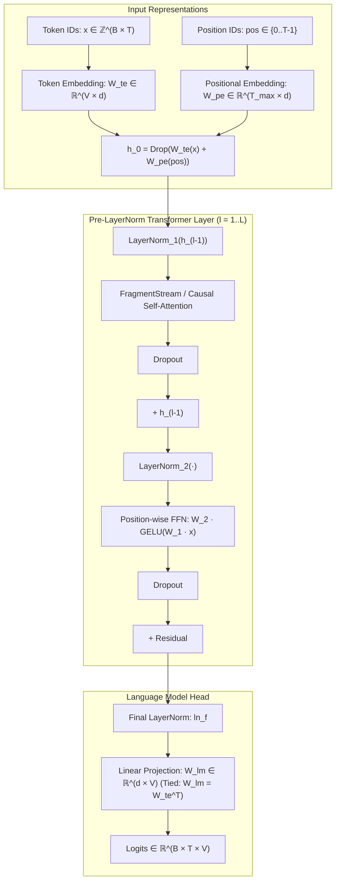
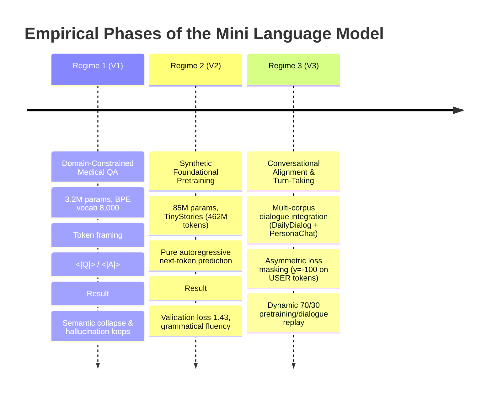

# Scaling Coherent Generation Under Severe Compute Constraints: Architectural Innovations, Pretraining Dynamics, and Conversational Alignment in Sub-100M Language Models

**Technical Report & Research Documentation**  
**Principal Investigator / Author:** Yash Rawal  
**Primary Compute Environment:** Distributed Commodity Cloud Accelerators (NVIDIA Tesla P100 16GB / 2 $\times$ Tesla T4 15GB PCIe)  
**Code Repository & Artifacts:** `mini_language_model` (`mlm-v3-trainb.ipynb`, `mlm-v3-dataset.ipynb`, `FragmentStream_Attention_llm.md`)  

---

## Abstract

Contemporary autoregressive large language models (LLMs) operate under scaling paradigms that presuppose tens of billions of parameters, trillion-token pretraining corpora, and massive accelerator clusters equipped with high-bandwidth memory (HBM) and specialized hardware matrix engines (e.g., Ampere/Hopper Tensor Cores). This report examines the opposite frontier: **What are the theoretical and architectural limits of language modeling when parameters ($\le 100\text{M}$), compute budget (single/dual consumer-tier GPUs), and context windows are strictly constrained?** 

We document the design, iterative failure analysis, and ongoing conversational alignment of the **Mini Language Model (MLM)** project. We introduce **FragmentStream Attention**, an algorithm designed to prevent memory exhaustion by tiling query-key-value interactions along the sequence dimension without instantiating the quadratic $\mathcal{O}(T^2)$ attention matrix. Furthermore, we analyze the empirical trajectory across three regimes: (1) an initial domain-specific clinical question-answering formulation characterized by degenerate repetitive attractors, (2) a foundation pretraining stage on 462M tokens of synthetically generated causal narratives (**TinyStories**), which successfully yields fluent, grammatically robust English story generation at a validation cross-entropy loss of **1.43**, and (3) an active conversational alignment phase employing dual-corpus weighted sampling (70/30) and asymmetric loss masking on user prompt tokens to eliminate monologue drift without inducing catastrophic forgetting.

---

## 1. Introduction & Theoretical Motivation

### 1.1 The Disconnect in Scaling Laws
Neural scaling laws demonstrate that language modeling loss scales as a power-law with respect to compute, parameter count, and dataset size. However, under extreme sub-100M parameter regimes, training on heterogeneous, noisy web scrape distributions (e.g., Common Crawl) fails to reach the critical perplexity threshold required for basic syntactic and causal coherence. The representations remain diffuse, resulting in ungrounded token generation, hallucination cascades, and repetitive loops.

To counter this, this research investigates the hypothesis posited by Eldan & Li (2023): **Restricting the linguistic universe to high-density, syntactically clean, logically coherent synthetic corpora allows small models ($<100\text{M}$) to internalize consistent grammar, world concepts, and tracking of narrative agents.**

### 1.2 The Hardware & Memory Bottleneck
Modern FlashAttention achieves near-optimal GPU memory IO efficiency by fusing attention computation within SRAM. However, FlashAttention relies heavily on hardware features available primarily in newer GPU microarchitectures (sm_80+ Ampere, Ada Lovelace, Hopper). Older architectures (e.g., Pascal sm_60 like the Tesla P100 or Turing sm_75 like the Tesla T4) frequently face Out-Of-Memory (OOM) faults during scaled self-attention passes when sequence lengths scale to $T \ge 512$ under non-trivial batch sizes. Addressing this constraint necessitated the development of a chunked memory attention mechanism deployable on legacy CUDA hardware.

---

## 2. Architectural Design



The core architecture is an autoregressive, decoder-only Transformer adhering to the Pre-LayerNorm paradigm with tied input-output embeddings.

### 2.1 Formal Model Specification

Given a sequence of input token indices $\mathbf{x} = (x_1, x_2, \dots, x_T) \in \mathcal{V}^T$, the model computes hidden representations $\mathbf{h}_l \in \mathbb{R}^{B \times T \times d}$:

$$\mathbf{h}_0 = \mathbf{E}_{tok}(\mathbf{x}) + \mathbf{E}_{pos}(\mathbf{p})$$

For each layer $l \in [1, L]$:
$$\mathbf{h}'_l = \mathbf{h}_{l-1} + \text{Attention}\left(\text{LN}(\mathbf{h}_{l-1})\right)$$
$$\mathbf{h}_l = \mathbf{h}'_l + \text{FFN}\left(\text{LN}(\mathbf{h}'_l)\right)$$

The final predictions are normalized and projected back to the vocabulary:
$$\hat{\mathbf{y}} = \text{Softmax}\left(\mathbf{E}_{tok}^T \cdot \text{LN}_{final}(\mathbf{h}_L)\right)$$

| Hyperparameter | Symbol | Pretraining Baseline (V2) | Conversational Model (V3) |
| :--- | :--- | :--- | :--- |
| **Number of Layers** | $L$ | 8 | 12 |
| **Attention Heads** | $H$ | 8 | 12 |
| **Hidden Dimension** | $d$ | 128 / 768 | 768 |
| **Head Dimension** | $d_k = d/H$ | 16 / 64 | 64 |
| **FFN Expansion** | $d_{ff}$ | $4d = 512 / 3072$ | $4d = 3072$ |
| **Context Length** | $T_{max}$ | 256 / 512 | 512 |
| **Vocabulary Size** | $|\mathcal{V}|$ | 8,000 | 25,000 / 32,000 |
| **Total Parameters** | $N$ | $\approx 3.2\text{M} - 85\text{M}$ | $\approx 85\text{M} - 109\text{M}$ |

Weight tying ($\mathbf{W}_{lm} = \mathbf{W}_{te}$) is enforced to eliminate parameter redundancy in the output projection, reducing total parameter footprint by $|\mathcal{V}| \times d$ parameters.

---

### 2.2 FragmentStream Attention: Algorithm and Complexity

Standard multi-head attention computes:
$$\mathbf{S} = \frac{\mathbf{Q} \mathbf{K}^T}{\sqrt{d_k}} \in \mathbb{R}^{B \times H \times T \times T}$$
$$\mathbf{A} = \text{Softmax}(\mathbf{S} + \mathbf{M})$$
$$\mathbf{O} = \mathbf{A}\mathbf{V} \in \mathbb{R}^{B \times H \times T \times d_k}$$

The explicit materialization of $\mathbf{S}$ and $\mathbf{A}$ requires $\mathcal{O}(B \cdot H \cdot T^2)$ high-speed memory. When $B=32$ and $T=512$, this creates transient tensors that overwhelm VRAM on memory-constrained GPUs.

#### Algorithmic Formulation
`FragmentStream_Attention` partitions the sequence dimension into discrete query and key/value chunks of size $S_{frag}$ (default: 128 tokens):

```
Algorithm: FragmentStream Attention Forward Pass
Input: Q, K, V ∈ ℝ^(B × T × d), Causal Mask Tril ∈ ℝ^(T × T), Chunk Size S_frag
Output: O ∈ ℝ^(B × T × d)

1: Initialize O = 0_(B, T, d)
2: For i = 0 to T step S_frag do:
3:     i_end = min(T, i + S_frag)
4:     Q_chunk = Q[:, i : i_end, :]                                 // Shape: (B, S_q, d)
5:     Initialize S_row = 0_(B, i_end - i, T)
6:     For j = 0 to T step S_frag do:
7:         j_end = min(T, j + S_frag)
8:         K_chunk = K[:, j : j_end, :]                             // Shape: (B, S_k, d)
9:         Block_Score = (Q_chunk @ K_chunk^T) / sqrt(d)            // Shape: (B, S_q, S_k)
10:        Block_Score.masked_fill(Tril[i:i_end, j:j_end] == 0, -inf)
11:        S_row[:, :, j : j_end] = Block_Score
12:    End For
13:    A_row = Softmax(S_row, dim=-1)                                // Softmax across full T
14:    A_row = Dropout(A_row)
15:    For j = 0 to T step S_frag do:
16:        j_end = min(T, j + S_frag)
17:        V_chunk = V[:, j : j_end, :]                             // Shape: (B, S_k, d)
18:        O[:, i : i_end, :] += A_row[:, :, j : j_end] @ V_chunk
19:    End For
20: End For
21: Return O
```

#### Theoretical Memory Reduction
- **Standard Attention Peak Transient Allocation:** $\mathcal{O}(B \cdot H \cdot T \cdot T)$
- **FragmentStream Peak Intermediate Allocation:** $\mathcal{O}(B \cdot H \cdot S_{frag} \cdot T)$
- When $T = 1024$ and $S_{frag} = 128$, instantaneous attention score footprint during intermediate matrix multiplication decreases by an asymptotic factor of $\frac{T}{S_{frag}} \approx 8\times$.

---

## 3. Empirical Progression & Paradigm Shifts



### 3.1 Regime 1: The Clinical QA Pathology (V1)
In initial iterations, the model was evaluated directly on specialized domain pairs:
- **Dataset:** Clinical question-answering corpus (`mini-clinical-dataset`), formatted via artificial delimiters:
  $$\mathbf{x} = \texttt{<\|Q\|>} \circ \text{Question} \circ \texttt{<\|A\|>} \circ \text{Answer} \circ \texttt{<\|END\|>}$$
- **Observed Failure Modes:**
  1. **Attractor State Loops:** When conditioned on out-of-domain conversational queries (e.g., `"Hello"`), the model degenerated into stationary cyclic loops:
     > *"It is a common problem of the skin. It is a fungal infection. It is a common cause of the skin infection. It is a fungal infection..."*
  2. **Pathology Analysis:** Because the dataset lacked open-domain distributional variety, the cross-entropy objective forced probability mass onto dominant medical n-grams regardless of the conditioning context. The model lacked sufficient parameter capacity to decouple prompt framing from medical symptom generation.

---

### 3.2 Regime 2: Synthetic Foundation Pretraining (V2 Milestone)
Recognizing that linguistic syntax and narrative world-models must precede instruction-following, the pretraining corpus was replaced with **TinyStories V2** (GPT-4 synthetic stories):

#### Experimental Setup
- **Data Volume:** 462,863,682 training tokens; 4,652,603 validation tokens.
- **Representation:** Custom BPE Tokenizer ($\mathcal{V} = 25,000 - 32,000$ tokens).
- **Optimization:** AdamW ($\beta_1 = 0.9, \beta_2 = 0.95$, weight decay $= 0.1$).
- **Learning Rate Schedule:** Cosine decay from $3 \times 10^{-4}$ to $3 \times 10^{-5}$ with a 1,000-step linear warmup.
- **Hardware Orchestration:** Distributed `nn.DataParallel` across 2 $\times$ NVIDIA Tesla T4 GPUs (Batch size $8 \times 8$ gradient accumulation $\times 2\text{ GPUs} = \text{effective batch size of } 128$).

#### Empirical Validation
The model reached a cross-entropy validation loss of **$\mathcal{L}_{val} \approx 1.43$** ($Perplexity \approx 4.18$). 

```
Sample Generation (Unconditional / Story Prompt):
Prompt: "Tom and Lily were playing in the park when"
Output: "...they saw a small bird sitting on a high branch. The bird was singing a lovely song,
         but its wing was hurt. Tom said, 'We must be gentle and help it.' Lily found some soft
         leaves to make a bed for the bird..."
```

**Finding:** The model demonstrated stable pronoun reference tracking, causal consistency, and punctuation termination, verifying that sub-100M parameter models can reliably master coherent syntax when trained on low-entropy, high-density data.

---

### 3.3 Regime 3: Conversational Alignment & Loss Masking (Current V3 Frontier)
While the V2 model produces coherent English prose, prompting it with human queries (`"What is your name?"` or `"How are you?"`) causes it to treat user prompts as story openings, continuing with narrative fiction rather than replying conversationally. Regime 3 introduces targeted dialogue alignment.

#### Multi-Turn Dialogue Curation (`mlm-v3-dataset.ipynb`)
To teach conversational turn-taking, three open conversational corpora were harmonized and tokenized into unified sequences:
1. **DailyDialog:** Multi-turn exchanges reflecting everyday human interactions.
2. **PersonaChat:** Structured persona-conditioned dialogs, parsed to strip ParlAI meta-headers while retaining speaker turns.
3. **EmpatheticDialogues:** Emotionally grounded conversational turns.
4. **Tokenization Format:**
   $$\mathbf{x} = \texttt{USER:} \circ \mathbf{u}_1 \circ \texttt{BOT:} \circ \mathbf{b}_1 \circ \dots \circ \texttt{<\|endoftext\|>}$$
   where `USER:` ($id=566$), `BOT:` ($id=567$), and `<|endoftext|>` ($id=0$) serve as explicit behavioral control tokens.

#### Mathematical Formulation of Target-Only Loss Masking
Standard autoregressive language modeling penalizes predictions across every sequence token:
$$\mathcal{L}_{std}(\theta) = -\sum_{t=1}^T \log P_\theta(x_t \mid x_{<t})$$

In conversational tuning, conditioning on human user prompts should not penalize the model for arbitrary phrasing of user inputs. We define an indicator mask $m_t \in \{0, 1\}$:
$$m_t = \begin{cases} 1 & \text{if } x_t \in \text{Assistant / BOT turn} \\ 0 & \text{if } x_t \in \text{User / Prompt turn} \end{cases}$$

The aligned loss is:
$$\mathcal{L}_{aligned}(\theta) = -\frac{1}{\sum_{t=1}^T m_t} \sum_{t=1}^T m_t \cdot \log P_\theta(x_t \mid x_{<t})$$

In PyTorch, this is implemented by assigning $y_{target}[b, t] = -100$ (`ignore_index`) for all tokens preceding `BOT:` delimiters.

```python
# Asymmetric Loss Masking Implementation (from mlm-v3-trainb.ipynb)
for b in range(batch_size):
    in_user = True
    for t in range(BLOCK_SIZE):
        if x[b, t] == USER_ID:
            in_user = True
        elif x[b, t] == BOT_ID:
            in_user = False
        if in_user:
            y[b, t] = -100  # Mask out user input from gradient updates
```

#### Experience Replay (Weighted Mixture Sampling)
To eliminate **catastrophic forgetting** of pretraining grammar and syntax during conversational fine-tuning, training batches are sampled from a mixture distribution $\mathcal{D}_{mix}$:
$$\mathcal{D}_{mix} = \alpha \mathcal{D}_{story} + (1 - \alpha) \mathcal{D}_{dialogue}, \quad \text{where } \alpha = 0.70$$

Each optimization step evaluates:
- 70% probability: Next-token prediction on continuous TinyStories prose without masking.
- 30% probability: Conversational dialogue batches with user-token loss masking enabled.

---

## 4. Quantitative Metrics & Training Dynamics

### 4.1 Evaluation Loss Trajectory (Fine-Tuning Phase)

```
Step      0 | Train: 1.3735 (Story: 1.41, Dialog: 1.29) | Val: 1.7585 (Story: 1.43, Dialog: 2.52) | LR: 0.00e+00
Step    500 | Train: 1.3446 (Story: 1.44, Dialog: 1.13) | Val: 1.6519 (Story: 1.46, Dialog: 2.10) | LR: 4.99e-05
Step   1000 | Train: 1.3470 (Story: 1.45, Dialog: 1.12) | Val: 1.6630 (Story: 1.43, Dialog: 2.20) | LR: 4.93e-05
```

### 4.2 Diagnostic Interpretations
1. **Story Retention:** Validation loss on TinyStories ($\mathcal{L}_{val, story}$) remains tightly bounded between **1.43 and 1.46**, indicating that the 70% replay ratio successfully prevents destruction of the base model's narrative and grammatical capabilities.
2. **Dialogue Generalization Gap:** Dialogue validation loss ($\mathcal{L}_{val, dialog} \approx 2.10 - 2.20$) remains higher than dialogue training loss ($\mathcal{L}_{train, dialog} \approx 1.12$). This divergence reflects the high entropy and multi-modal distribution inherent in human daily conversations compared to synthetic children's stories.

---

## 5. Artifact & Repository Catalog

```
mini_language_model/
├── mlm-v3-trainb.ipynb             # Production training notebook (DataParallel, Cosine LR, Masked Loss)
├── mlm-v3-dataset.ipynb            # Data curation pipeline (DailyDialog, PersonaChat, EmpatheticDialogues)
├── FragmentStream_Attention_llm.md # PyTorch reference implementation of FragmentStream tiled attention
├── 1.md                            # Mathematical derivations of causal scaled dot-product attention
├── documentation.md                # Comprehensive technical documentation & research report
├── GOAL.txt                        # Original research manifesto and empirical constraints
├── PLAN                            # Strategic roadmap across developmental milestones
├── Dataset.txt                     # Hugging Face TinyStories schema inspection
└── kaggletoken.txt                 # Kaggle CLI remote synchronization credentials
```

---

## 6. Open Research Challenges & Future Work

1. **Kernel-Level Tiling for FragmentStream Attention:**  
   The current implementation of `FragmentStream_Attention` executes via high-level PyTorch tensor slicing. While this drastically lowers peak VRAM requirements, Python loop overhead imposes execution latency penalties relative to fused C++/CUDA kernels. Implementing FragmentStream directly via OpenAI Triton would combine the VRAM efficiency of tiling with the execution speed of fused kernels on older SM architectures.

2. **Inference KV-Cache Integration for Streaming:**  
   Autoregressive generation currently recalculates keys and values across the context window at each generation step. Integrating dynamic key-value caching (KV-cache) within the fragment streaming forward pass is essential to achieve real-time latency during multi-turn chat generation.

3. **Direct Preference Optimization (DPO) at Ultra-Low Scale:**  
   Investigating whether sub-100M parameter models can reliably benefit from DPO (Rafailov et al., 2023) to suppress hallucination loops and enforce conversational turn termination without destabilizing language modeling loss.

---

## 7. References

1. Vaswani, A., et al. (2017). *Attention Is All You Need*. Advances in Neural Information Processing Systems (NeurIPS).
2. Eldan, R., & Li, Y. (2023). *TinyStories: How Small Can Language Models Be and Still Speak Coherent English?* arXiv preprint arXiv:2305.07759.
3. Dao, T., et al. (2022). *FlashAttention: Fast and Memory-Efficient Exact Attention with IO-Awareness*. Advances in Neural Information Processing Systems (NeurIPS).
4. Radford, A., et al. (2019). *Language Models are Unsupervised Multitask Learners*. OpenAI Technical Report.
5. Li, J., et al. (2017). *DailyDialog: A Manually Labelled Multi-turn Dialogue Dataset*. International Joint Conference on Natural Language Processing (IJCNLP).
6. Zhang, S., et al. (2018). *Personalizing Dialogue Agents: I have a dog, do you have pets too?* ACL 2018.
