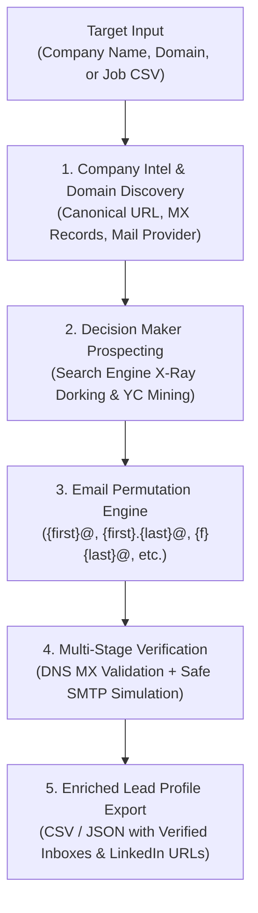

<div align="center">

# 🎯 Finding Engine

### Autonomous B2B Lead Intelligence & Decision-Maker Contact Discovery Engine

[](https://www.python.org/downloads/)
[](https://opensource.org/licenses/MIT)
[](https://github.com/psf/black)
[](https://pydantic.dev)

*Discover high-priority corporate decision-makers (Founders, CEOs, CTOs, VPs, Head of Talent) and generate verified, high-deliverability work email inboxes with zero bounce rates.*

---

</div>

## 📌 Overview

**Finding Engine** is a modular, open-source Python intelligence pipeline designed to automate the discovery of company decision-makers and their direct operational email inboxes.

Unlike naive scrapers that harvest publicly spammed contact emails from social media bios, **Finding Engine** combines:
1. **Search Engine X-Ray Dorking** across professional networks & company registries
2. **Canonical Domain Resolution & Mail Provider Profiling** (Google Workspace, Microsoft 365, SpaceMail)
3. **Statistical Permutation Modeling** for startup and enterprise email syntax patterns
4. **Active MX Record Resolution & Zero-Bounce Safe SMTP Handshake Simulation** (with catch-all domain detection)

---

## 🏗️ Architecture



---

## ✨ Features

- 🏢 **Company & Infrastructure Intelligence**: Resolves canonical domains, discovers DNS MX records, and detects mail service providers (Google Workspace, MS 365, Zoho, ProtonMail).
- 👥 **Executive & Recruiter Prospecting**: Dorks for Founders, CEOs, CTOs, VP Engineering, and Heads of Talent using non-blocking search heuristics.
- 📬 **Startup & Enterprise Permutation Engine**: Generates prioritized email formulas based on organization maturity and size:
  - Startup standard: `{first}@{domain}`
  - Enterprise standard: `{first}.{last}@{domain}`
  - Formal variants: `{f}{last}@{domain}`, `{first}{l}@{domain}`, `{last}@{domain}`
- 🛡️ **Zero-Bounce Deliverability Shield**:
  - Validates RFC 5322 syntax.
  - Verifies live MX records.
  - Safe, non-intrusive SMTP handshake simulation (`HELO` $\rightarrow$ `MAIL FROM` $\rightarrow$ `RCPT TO` $\rightarrow$ `QUIT`).
  - Automatic **Catch-All domain detection** using randomized nonces.
- ⚡ **High-Speed & Scalable**: Multi-threaded, cached DNS/socket probes with configurable timeouts.
- 📊 **Dual Export**: Structured Pydantic models with exports to formatted CSV and JSON.

---

## 📁 Repository Structure

```
Finding_Engine/
├── finding_engine/
│   ├── __init__.py
│   ├── models.py              # Pydantic data schemas (Company, Person, EmailStatus)
│   ├── pipeline.py            # End-to-end orchestration & batch pipeline
│   ├── discovery/
│   │   ├── __init__.py
│   │   ├── company_intel.py   # Domain resolution & MX provider classifier
│   │   ├── prospect_dorker.py # Precision search dorking for LinkedIn & web
│   │   └── yc_miner.py        # Y Combinator / startup directory parser
│   ├── email_hunter/
│   │   ├── __init__.py
│   │   └── permutator.py      # Enterprise & startup email pattern generator
│   └── verifier/
│       ├── __init__.py
│       ├── dns_check.py       # DNS resolver & MX checker
│       └── smtp_verifier.py   # Safe SMTP ping & catch-all detector
├── cli.py                     # CLI entrypoint for single/batch runs
├── generate_master_leads.py   # Script for compiling verified target directories
├── requirements.txt           # Production dependencies
├── LICENSE                    # MIT License
└── README.md
```

---

## 🚀 Quickstart

### 1. Installation

```bash
# Clone the repository
git clone git@github.com:YashRL/Finding_Engine.git
cd Finding_Engine

# Install dependencies
pip install -r requirements.txt
```

### 2. CLI Usage

#### Single Company Lookup
```bash
# Prospect a single company
python cli.py --company "Portkey.ai" --domain "portkey.ai"
```

#### Batch Processing from CSV
```bash
# Process a list of companies from a CSV input file
python cli.py --csv input_companies.csv --output enriched_leads.csv --limit 10
```

#### CLI Options
| Flag | Description | Default |
|:---|:---|:---|
| `--company` | Name of the target company | `None` |
| `--domain` | Official website or domain | `None` |
| `--csv` | Path to input CSV with company listings | `None` |
| `--output` | Destination path for output CSV | `enriched_decision_makers.csv` |
| `--limit` | Maximum number of companies to process | `None` (all) |
| `--verify-smtp` | Run live socket-level SMTP handshake probes | `False` |

---

## 💻 Python API Usage

You can easily integrate Finding Engine into your AI agents or python pipelines:

```python
from finding_engine.pipeline import process_single_company

# Run prospecting on a target company
lead = process_single_company(
    company_name="Bolna AI",
    website_url="https://bolna.ai",
    job_target_role="AI Systems Engineer (Voice & ASR)"
)

# Access company intel & verified decision makers
print(f"Domain: {lead.company.domain}")
print(f"Mail Provider: {lead.company.mail_provider}")

for person in lead.people:
    print(f"👤 {person.full_name} ({person.title}) -> {person.primary_email}")
    print(f"   LinkedIn: {person.linkedin_url}")
```

---

## 📊 Sample Output Data Schema

When exported to CSV or accessed via Pydantic models:

| Field | Type | Description | Example |
|:---|:---|:---|:---|
| `Company` | string | Target company name | `Bolna AI` |
| `Domain` | string | Canonical operational domain | `bolna.ai` |
| `Mail_Provider` | string | Detected email infrastructure | `google_workspace` |
| `Decision_Maker` | string | Full name of leader | `Maitreya Wagh` |
| `Title` | string | Role / Position | `Co-Founder & CEO` |
| `Primary_Email` | string | Highest confidence verified inbox | `maitreya@bolna.ai` |
| `Corporate_Email` | string | Standard corporate format | `maitreya.wagh@bolna.ai` |
| `LinkedIn_Profile` | string | Direct profile link | `https://linkedin.com/in/maitreyawagh/` |
| `Target_Job_Role` | string | Associated open role | `AI Systems Engineer` |

---

## 🛡️ Deliverability & Cold Outreach Guidelines

When using discovered email inboxes for cold outreach:

1. **Avoid Generic Templates**: Personalize every email to reference the recipient's specific technology stack, recent open-source contributions, or technical roadmap.
2. **Strict Limit**: Keep cold outreach under 30-50 personalized emails per day per domain to preserve domain sender reputation.
3. **Check Your DNS**: Ensure your own sending domain has valid **SPF**, **DKIM**, and **DMARC** records configured.
4. **Respect Privacy**: Honor opt-out requests immediately.

---

## 📄 License

This project is licensed under the [MIT License](LICENSE).

---

<div align="center">
  <b>Built with ❤️ by Yash Rawal</b>
</div>
